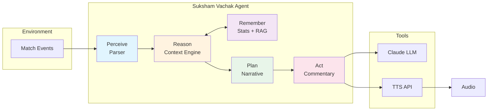
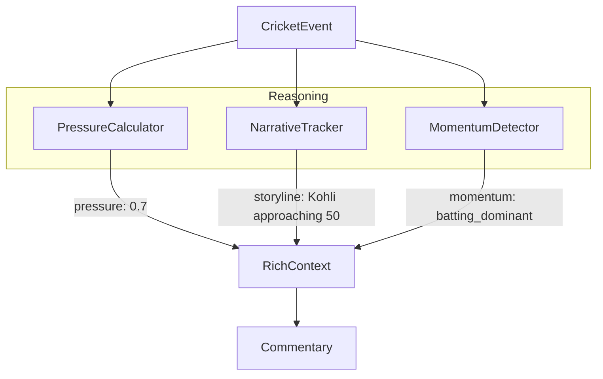
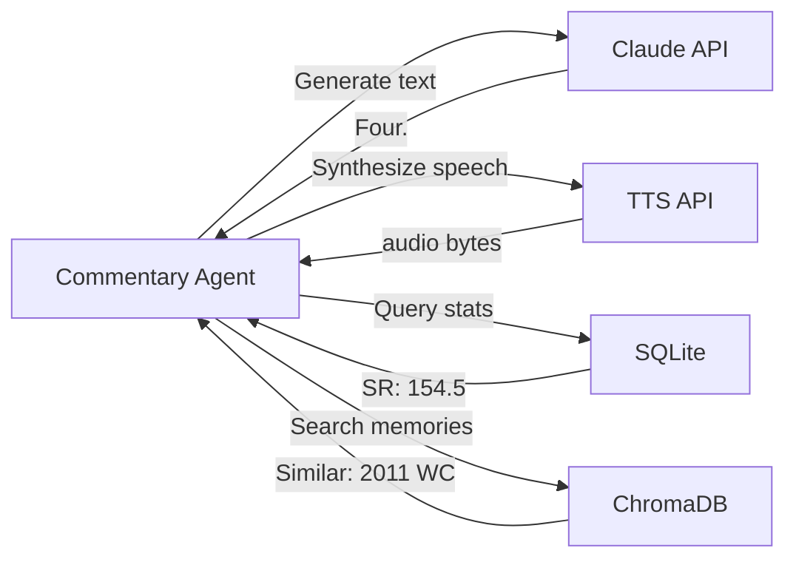
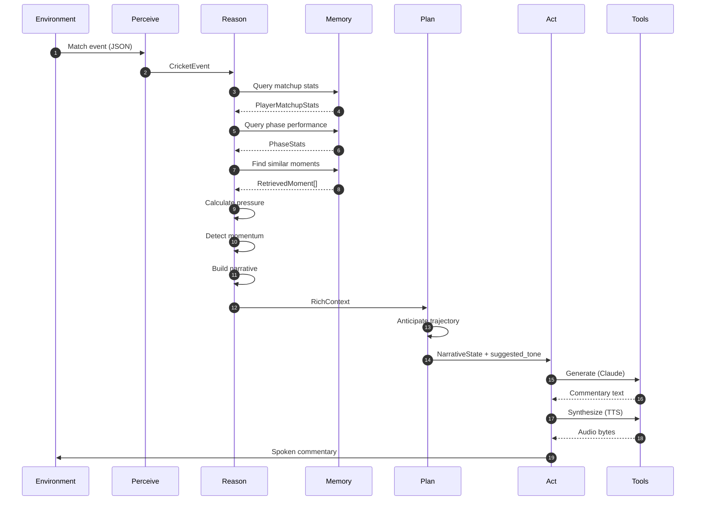

# Agentic AI Architecture

> How Suksham Vachak implements the Agentic AI paradigm for autonomous cricket commentary.

---

## What is Agentic AI?

Agentic AI systems are autonomous agents that:

1. **Perceive** their environment
2. **Reason** about what they observe
3. **Remember** relevant context (short and long-term)
4. **Plan** their actions based on goals
5. **Act** to achieve objectives
6. **Learn** from outcomes

Unlike traditional AI that simply maps inputs to outputs, agentic systems maintain state, use tools, and make decisions autonomously.

---

## The Agentic Loop



---

## Capability Mapping

| Agentic Capability    | Component                  | Implementation                                                           |
| --------------------- | -------------------------- | ------------------------------------------------------------------------ |
| **Perception**        | `Parser`                   | Transforms raw Cricsheet JSON into typed `CricketEvent` stream           |
| **Reasoning**         | `ContextBuilder`           | Calculates pressure (0-1), detects momentum shifts, identifies narrative |
| **Short-term Memory** | `NarrativeTracker`         | Tracks current storyline, subplots, recent events within match           |
| **Long-term Memory**  | `StatsEngine`              | SQLite database of historical player matchups, phase stats, form         |
| **Episodic Memory**   | `DejaVu RAG`               | ChromaDB vectors of memorable moments for callbacks                      |
| **Planning**          | `PhaseEngine + FormEngine` | Anticipates match trajectory based on phase and player trends            |
| **Personality**       | `Personas`                 | Benaud (minimalist), Greig (dramatic), Bhogle (analytical)               |
| **Tool Use**          | `LLM + TTS`                | Claude for generation, Google/Azure/ElevenLabs for speech                |
| **Action**            | `CommentaryEngine`         | Produces contextual, persona-appropriate natural language                |

---

## Deep Dive: Each Capability

### 1. Perception (Parser)

The agent's sensory input. Converts raw match data into structured observations.

```python
# Raw input (Cricsheet JSON)
{"batter": "V Kohli", "bowler": "JM Anderson", "runs": {"batter": 4}}

# Perceived as (CricketEvent)
CricketEvent(
    event_type=EventType.BOUNDARY_FOUR,
    batter="V Kohli",
    bowler="JM Anderson",
    runs=4,
    ball_number="15.3",
    match_context=MatchContext(...)
)
```

**Why it matters:** Clean perception enables accurate reasoning. The parser normalizes player names, detects event types, and enriches with match context.

---

### 2. Reasoning (Context Engine)

The agent's cognitive core. Transforms observations into understanding.



**Pressure Calculation** (multi-factor reasoning):

```python
pressure = 0.0
pressure += phase_base[death_overs]      # +0.5 (high base in death)
pressure += chase_pressure(req_rate)      # +0.2 (RRR > CRR)
pressure += wicket_cluster(3_in_5_overs)  # +0.2 (collapse)
pressure += new_batter_vulnerability      # +0.1
# Result: 1.0 (critical)
```

**Why it matters:** Raw events don't tell the story. "Kohli hits four" means different things at 10/0 vs 180/8. Reasoning provides meaning.

---

### 3. Memory Systems

The agent has three types of memory:

#### Short-term (Working Memory)

```python
class NarrativeTracker:
    current_storyline: str      # "Boundaries flowing!"
    key_subplot: str            # "Kohli 5 away from fifty"
    momentum: MomentumState     # BATTING_DOMINANT
    recent_events: list[Event]  # Last 12 balls
```

#### Long-term (Semantic Memory)

```python
class StatsEngine:
    # Head-to-head: Kohli vs Anderson
    matchups.get_head_to_head("V Kohli", "JM Anderson")
    # → 85 runs, 55 balls, SR 154.5, 1 dismissal

    # Phase performance: Kohli in death overs
    phases.get_phase_performance("V Kohli", "death", "T20")
    # → SR 185, 15 matches

    # Recent form: Last 5 matches
    form.get_recent_form("V Kohli")
    # → improving, avg 52, SR 145
```

#### Episodic Memory (RAG)

```python
class DejaVuRetriever:
    # Find similar moments
    retrieve("Kohli four off Anderson in tense chase")
    # → "Reminiscent of the 2013 Champions Trophy..."
```

**Why it matters:** Memory enables callbacks ("He's done this before"), pattern recognition, and narrative continuity.

---

### 4. Planning (Anticipation)

The agent anticipates based on context:

```python
# Phase-aware planning
if phase == "death" and player.death_overs_sr > 180:
    suggested_tone = "anticipatory"
    # "Kohli loves these situations..."

# Form-based anticipation
if form.trend == "improving" and approaching_milestone:
    dramatic_potential = "high"
    # "The way he's batting, the fifty seems inevitable..."

# Matchup-aware planning
if matchup.dismissals >= 3 and matchup.balls_faced < 50:
    narrative_hint = "vulnerability"
    # "Anderson has had the better of this contest..."
```

**Why it matters:** Great commentary anticipates, not just reacts. Planning enables "reading the game."

---

### 5. Personality (Personas)

Consistent behavioral traits that shape output:

| Persona | Minimalism | Emotion Range | Style                             |
| ------- | ---------- | ------------- | --------------------------------- |
| Benaud  | 95%        | Low           | "Four."                           |
| Greig   | 20%        | High          | "What a shot! The crowd erupts!"  |
| Bhogle  | 50%        | Medium        | "Kohli finds the gap, four more." |

```python
@dataclass
class Persona:
    name: str
    minimalism_level: float     # 0.0 = verbose, 1.0 = terse
    emotion_range: tuple        # (min, max) excitement
    signature_phrases: list     # ["Marvellous", "Gone"]
    avoids: list               # ["incredible", "amazing"]
```

**Why it matters:** Personality creates authenticity. Each persona has distinct voice, vocabulary, and emotional expression.

---

### 6. Tool Use (External Capabilities)

The agent leverages external tools:



**Why it matters:** Tools extend capabilities beyond the core model. The agent orchestrates multiple services.

---

### 7. Action (Output Generation)

The agent produces contextual, styled output:

```python
# Input: CricketEvent + RichContext + Persona
# Output: Commentary with appropriate:
#   - Length (based on minimalism)
#   - Emotion (based on pressure + event significance)
#   - Content (incorporating stats, memories, narrative)
#   - Voice (persona-specific vocabulary)

commentary = engine.generate(
    event=four_off_anderson,
    context=RichContext(pressure=0.7, momentum=BATTING_DOMINANT),
    persona=BENAUD
)
# → "Four."  (minimalist acknowledges, moves on)

commentary = engine.generate(
    event=four_off_anderson,
    context=RichContext(pressure=0.7, momentum=BATTING_DOMINANT),
    persona=GREIG
)
# → "What a shot! Kohli's put that away with disdain!"
```

**Why it matters:** Action is the visible output. All perception, reasoning, and memory culminate in natural, engaging commentary.

---

## The Complete Agent Loop



---

## Comparison: Traditional vs Agentic

| Aspect         | Traditional AI   | Suksham Vachak (Agentic)                   |
| -------------- | ---------------- | ------------------------------------------ |
| **Input**      | Single event     | Event + full match context                 |
| **State**      | Stateless        | Rich state (pressure, momentum, narrative) |
| **Memory**     | None             | Short-term + Long-term + Episodic          |
| **Reasoning**  | Pattern matching | Multi-factor inference                     |
| **Output**     | Generic response | Contextual, persona-appropriate            |
| **Adaptation** | None             | Adjusts tone to situation                  |
| **Tools**      | Single model     | Orchestrates LLM + TTS + DB + Vector       |

---

## Why This Matters

### For Commentary Quality

Traditional: "Kohli hits a four."
Agentic: "Four. Kohli's done it again against Anderson - that's 85 runs off him now, and the pressure's mounting on England."

The agentic approach produces commentary that:

- Acknowledges history (memory)
- Understands significance (reasoning)
- Matches the moment (planning)
- Sounds authentic (personality)

### For System Design

The agentic architecture enables:

- **Modularity**: Each capability is a distinct component
- **Testability**: Reasoning can be tested independently
- **Extensibility**: Add new memory sources, tools, personas
- **Observability**: Each step produces interpretable intermediate state

---

## Implementation Checklist

| Capability        | Status | Component                    |
| ----------------- | ------ | ---------------------------- |
| Perception        | ✅     | `suksham_vachak/parser/`     |
| Reasoning         | ✅     | `suksham_vachak/context/`    |
| Short-term Memory | ✅     | `NarrativeTracker`           |
| Long-term Memory  | ✅     | `suksham_vachak/stats/`      |
| Episodic Memory   | ✅     | `suksham_vachak/rag/`        |
| Planning          | ✅     | `PhaseEngine`, `FormEngine`  |
| Personality       | ✅     | `suksham_vachak/personas/`   |
| Tool Use          | ✅     | LLM + TTS integrations       |
| Action            | ✅     | `suksham_vachak/commentary/` |

---

## References

- [Agentic AI Design Patterns](https://www.deeplearning.ai/the-batch/agentic-design-patterns-part-1/)
- [ReAct: Reasoning and Acting in Language Models](https://arxiv.org/abs/2210.03629)
- [Cognitive Architectures for AI Agents](https://lilianweng.github.io/posts/2023-06-23-agent/)

---

_"An agent is not just a model that responds. It's a system that perceives, reasons, remembers, and acts."_
