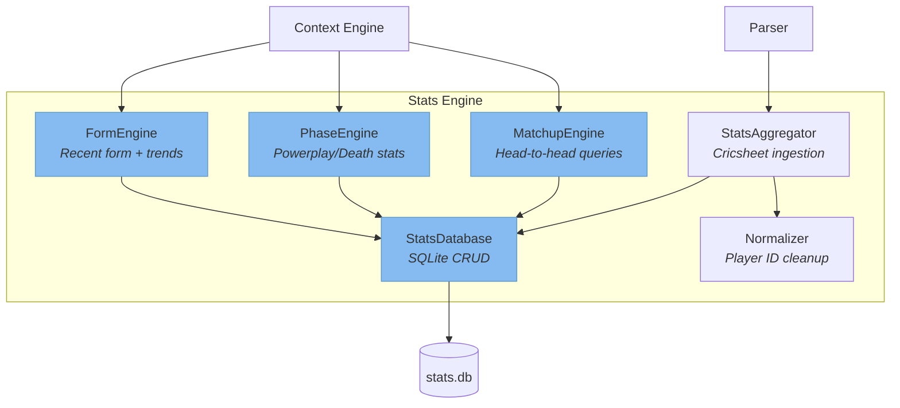
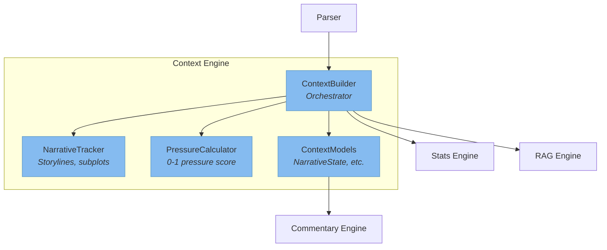
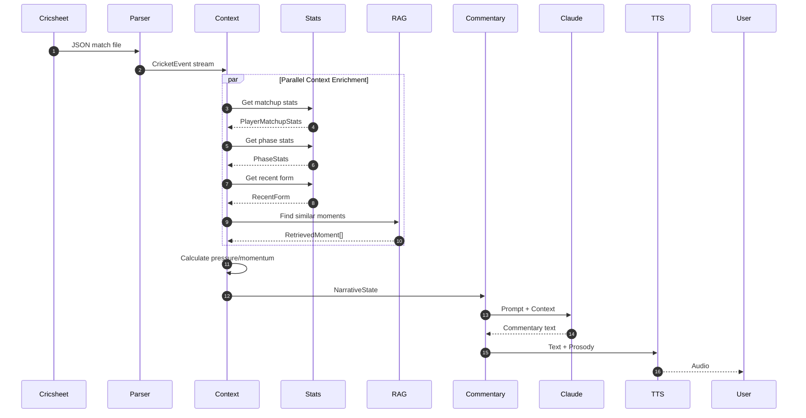
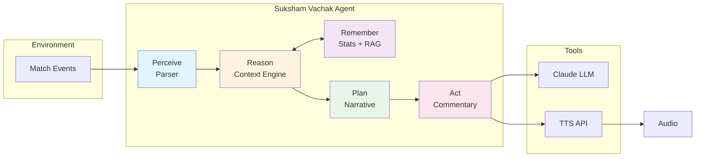
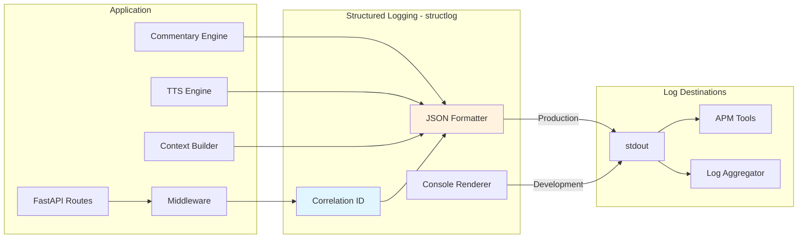
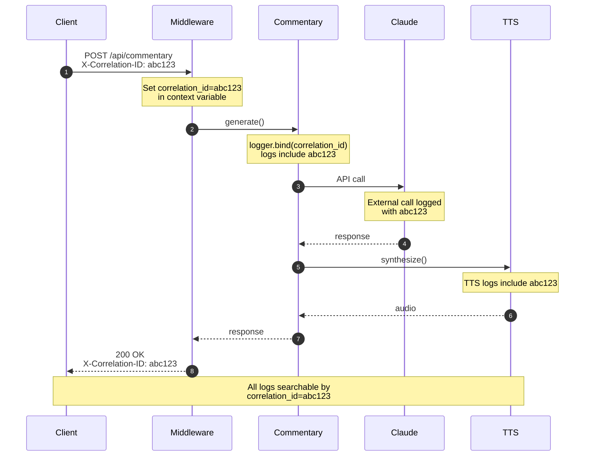

# Suksham Vachak - System Architecture

> **Document Version**: 5.3
> **Last Updated**: January 8, 2025
> **Status**: Phases 1-4 Complete + Local LLM (Ollama) Support

---

## C4 Architecture Diagrams

### Level 1: System Context

```mermaid
graph TB
    subgraph ext [External Systems]
        CS[("Cricsheet<br/>Ball-by-ball data")]
        LLM[("LLM Provider<br/>Claude/OpenAI")]
        TTS[("TTS Provider<br/>Google/Azure/ElevenLabs")]
    end

    subgraph users [Users]
        U1[("👤 Listener<br/>Receives commentary")]
        U2[("👤 Admin<br/>Configures personas")]
    end

    SV["🏏 Suksham Vachak<br/>AI Cricket Commentary Engine"]

    U1 -->|listens| SV
    U2 -->|configures| SV
    SV -->|fetches data| CS
    SV -->|generates text| LLM
    SV -->|synthesizes speech| TTS

    style SV fill:#1168bd,stroke:#0b4884,color:#fff
    style CS fill:#999,stroke:#666,color:#fff
    style LLM fill:#999,stroke:#666,color:#fff
    style TTS fill:#999,stroke:#666,color:#fff
```



### Level 2: Container Diagram

```mermaid
graph TB
    subgraph SV [Suksham Vachak]
        Parser["📄 Parser<br/><i>Python</i><br/>Cricsheet JSON → Events"]
        Context["🧠 Context Engine<br/><i>Python</i><br/>Pressure, Momentum, Narrative"]
        Stats["📊 Stats Engine<br/><i>Python/SQLite</i><br/>Matchups, Phases, Form"]
        RAG["🔍 RAG Engine<br/><i>Python/ChromaDB</i><br/>Historical Parallels"]
        Commentary["🎙️ Commentary Engine<br/><i>Python</i><br/>Persona + LLM Generation"]
        TTS["🔊 TTS Engine<br/><i>Python</i><br/>SSML + Audio Synthesis"]

        StatsDB[("💾 Stats DB<br/><i>SQLite</i>")]
        VectorDB[("💾 Vector DB<br/><i>ChromaDB</i>")]
    end

    CS[("Cricsheet")]
    LLM[("Claude API")]
    TTSAPI[("TTS API")]

    CS --> Parser
    Parser --> Context
    Context --> Stats
    Context --> RAG
    Stats --> StatsDB
    RAG --> VectorDB
    Context --> Commentary
    Commentary --> LLM
    Commentary --> TTS
    TTS --> TTSAPI

    style Parser fill:#438dd5,stroke:#2e6295,color:#fff
    style Context fill:#438dd5,stroke:#2e6295,color:#fff
    style Stats fill:#438dd5,stroke:#2e6295,color:#fff
    style RAG fill:#438dd5,stroke:#2e6295,color:#fff
    style Commentary fill:#438dd5,stroke:#2e6295,color:#fff
    style TTS fill:#438dd5,stroke:#2e6295,color:#fff
```



### Level 3: Stats Engine Components



### Level 3: Context Engine Components



### Data Flow Sequence



---

## Agentic AI Architecture

Suksham Vachak implements the **Agentic AI paradigm** — not just a model that responds, but a system that perceives, reasons, remembers, and acts autonomously.

### The Agentic Loop



### Capability Mapping

| Agentic Capability    | Component                  | Implementation                                                           |
| --------------------- | -------------------------- | ------------------------------------------------------------------------ |
| **Perception**        | `Parser`                   | Transforms raw Cricsheet JSON into typed `CricketEvent` stream           |
| **Reasoning**         | `ContextBuilder`           | Calculates pressure (0-1), detects momentum shifts, identifies narrative |
| **Short-term Memory** | `NarrativeTracker`         | Tracks current storyline, subplots, recent events within match           |
| **Long-term Memory**  | `StatsEngine`              | SQLite database of historical player matchups, phase stats, form         |
| **Episodic Memory**   | `DejaVu RAG`               | ChromaDB vectors of memorable moments for callbacks                      |
| **Planning**          | `PhaseEngine + FormEngine` | Anticipates match trajectory based on phase and player trends            |
| **Personality**       | `Personas`                 | Benaud (minimalist), Greig (dramatic), Bhogle (analytical)               |
| **Tool Use**          | `LLM + TTS`                | Claude for generation, Google/Azure/ElevenLabs for speech                |
| **Action**            | `CommentaryEngine`         | Produces contextual, persona-appropriate natural language                |

### Why Agentic Matters

**Traditional AI**: `"Kohli hits four"` → `"Nice shot!"`

**Suksham Vachak (Agentic)**: Same event produces `"Four. That's 85 off Anderson now — Kohli owns this matchup."` because it:

- **Remembers** the head-to-head history (Stats Engine)
- **Reasons** about match significance (Context Engine)
- **Plans** the narrative arc (Narrative Tracker)
- **Acts** with persona-appropriate restraint (Benaud)

> For a deep dive into the agentic architecture, see [AGENTIC.md](AGENTIC.md).

---

## Observability & APM

Suksham Vachak includes a production-ready observability stack for monitoring, debugging, and performance analysis.

### Logging Infrastructure



#### Key Components

| Component                      | File                               | Purpose                              |
| ------------------------------ | ---------------------------------- | ------------------------------------ |
| **Logging Config**             | `suksham_vachak/logging.py`        | Centralized structlog configuration  |
| **Correlation ID Middleware**  | `suksham_vachak/api/middleware.py` | Request tracing across services      |
| **Request Logging Middleware** | `suksham_vachak/api/middleware.py` | Timing, status codes, error tracking |

#### Environment Variables

```bash
# Logging Mode
LOG_ENV=production          # "production" for JSON, else pretty console

# Log Level
LOG_LEVEL=INFO              # DEBUG, INFO, WARNING, ERROR

# Per-Module Levels (JSON)
LOG_MODULE_LEVELS='{"suksham_vachak.api": "DEBUG", "suksham_vachak.tts": "WARNING"}'
```

#### Log Output Examples

**Development Mode** (pretty console):

```
14:32:15 [info     ] Request completed        correlation_id=a1b2c3d4 duration_ms=145.23 method=POST module=api.middleware path=/api/commentary status=200
14:32:15 [debug    ] Built rich context       correlation_id=a1b2c3d4 event_id=evt_123 module=commentary.engine
```

**Production Mode** (JSON for log aggregation):

```json
{
  "event": "Request completed",
  "level": "info",
  "timestamp": "2025-01-08T14:32:15.123Z",
  "correlation_id": "a1b2c3d4",
  "duration_ms": 145.23,
  "method": "POST",
  "path": "/api/commentary",
  "status": 200,
  "module": "api.middleware"
}
```

### APM Integration

With structured logging and correlation IDs in place, APM tools integrate seamlessly:

| APM Tool           | Integration Method            | Best For                                           |
| ------------------ | ----------------------------- | -------------------------------------------------- |
| **Datadog**        | `ddtrace` + JSON logs         | Full-stack observability, APM + logs + metrics     |
| **New Relic**      | Python agent + log forwarding | Traditional APM, synthetic monitoring              |
| **Sentry**         | `sentry-sdk`                  | Error tracking, performance monitoring             |
| **Honeycomb**      | Structured events via logs    | High-cardinality debugging, distributed tracing    |
| **OpenTelemetry**  | `opentelemetry-sdk`           | Vendor-neutral tracing, correlation ID propagation |
| **AWS CloudWatch** | JSON logs + X-Ray             | AWS-native, serverless deployments                 |
| **Grafana + Loki** | Log aggregation               | Self-hosted, Prometheus ecosystem                  |

#### Datadog Integration Example

```python
# Install: pip install ddtrace
# Run: DD_SERVICE=suksham-vachak ddtrace-run uvicorn suksham_vachak.api.app:app

from ddtrace import tracer, patch_all
patch_all()

# Correlation IDs automatically propagate to Datadog traces
# JSON logs are parsed and indexed automatically
```

#### Sentry Integration Example

```python
# Install: pip install sentry-sdk[fastapi]

import sentry_sdk
from sentry_sdk.integrations.fastapi import FastApiIntegration

sentry_sdk.init(
    dsn="https://xxx@sentry.io/xxx",
    integrations=[FastApiIntegration()],
    traces_sample_rate=0.1,  # 10% of requests traced
)

# Errors are captured with correlation_id context
```

#### OpenTelemetry Example

```python
# Install: pip install opentelemetry-sdk opentelemetry-instrumentation-fastapi

from opentelemetry import trace
from opentelemetry.instrumentation.fastapi import FastAPIInstrumentor

FastAPIInstrumentor.instrument_app(app)

# Correlation IDs can be propagated as trace context
# Set trace ID from X-Correlation-ID header in middleware
```

### Metrics to Monitor

| Category       | Metric                           | Source            | Alert Threshold        |
| -------------- | -------------------------------- | ----------------- | ---------------------- |
| **Latency**    | Request duration (p50, p95, p99) | Middleware        | p95 > 500ms            |
| **Throughput** | Requests per second              | Middleware        | < 10 rps (low traffic) |
| **Errors**     | 4xx/5xx rate                     | Middleware        | > 1% error rate        |
| **LLM**        | Claude API latency               | Commentary Engine | p95 > 2s               |
| **LLM**        | Token usage per request          | LLM Client        | > 500 tokens/request   |
| **TTS**        | Synthesis duration               | TTS Engine        | p95 > 1s               |
| **TTS**        | Cache hit rate                   | TTS Engine        | < 50% hit rate         |
| **Context**    | Context build time               | Context Builder   | p95 > 100ms            |
| **Stats**      | SQLite query time                | Stats Engine      | p95 > 50ms             |

### Dashboard Recommendations

```
┌─────────────────────────────────────────────────────────────────────────┐
│  SUKSHAM VACHAK - PRODUCTION DASHBOARD                                   │
├─────────────────────────────────────────────────────────────────────────┤
│                                                                          │
│  ┌─────────────┐  ┌─────────────┐  ┌─────────────┐  ┌─────────────┐    │
│  │   RPS: 45   │  │ p95: 234ms  │  │ Errors: 0.2%│  │ Cache: 78%  │    │
│  │   ↑ 12%     │  │   ↓ 5%      │  │   ↓ 0.1%    │  │   ↑ 3%      │    │
│  └─────────────┘  └─────────────┘  └─────────────┘  └─────────────┘    │
│                                                                          │
│  ┌────────────────────────────────────────────────────────────────────┐ │
│  │ Request Latency by Component                                        │ │
│  │                                                                      │ │
│  │  Context Build:  ████░░░░░░  25ms                                   │ │
│  │  LLM (Claude):   ████████████████████████░░░░░░  180ms              │ │
│  │  TTS Synthesis:  ████████░░░░░░░░░░░░░░░░  60ms                     │ │
│  │  Total:          ████████████████████████████████  265ms            │ │
│  └────────────────────────────────────────────────────────────────────┘ │
│                                                                          │
│  ┌────────────────────────────────────────────────────────────────────┐ │
│  │ Errors by Correlation ID (last 1h)                                  │ │
│  │                                                                      │ │
│  │  a1b2c3d4  POST /api/commentary  TTS timeout       14:32:15        │ │
│  │  e5f6g7h8  POST /api/commentary  Claude rate limit 14:28:03        │ │
│  └────────────────────────────────────────────────────────────────────┘ │
│                                                                          │
└─────────────────────────────────────────────────────────────────────────┘
```

### Correlation ID Flow

The `X-Correlation-ID` header enables end-to-end request tracing:



---

## Future: Authentication & Authorization

Authentication is not yet implemented. When needed, here are the recommended approaches:

### Option 1: Edge Authentication (Recommended for Demo/MVP)

Use **Cloudflare Access (Zero Trust)** for instant protection without code changes:

```
┌──────────────┐     ┌──────────────────┐     ┌──────────────────┐
│   Browser    │────▶│ Cloudflare Access│────▶│  Suksham Vachak  │
│              │     │                  │     │                  │
│  User logs   │     │  Google/GitHub   │     │  No auth code    │
│  in via IdP  │     │  OAuth flow      │     │  needed!         │
└──────────────┘     └──────────────────┘     └──────────────────┘
```

**Pros**: Zero code changes, handles OAuth flows, MFA support, audit logs
**Cons**: Cloudflare-specific, no fine-grained app permissions

### Option 2: FastAPI OAuth2 (Production)

Add OAuth2 directly to FastAPI when you need:

- API keys for programmatic access (iOS app, third-party integrations)
- Fine-grained permissions (admin vs user vs read-only)
- Token-based auth with refresh tokens
- Custom scopes per endpoint

```python
# Future implementation sketch
from fastapi import Depends, HTTPException, Security
from fastapi.security import OAuth2PasswordBearer, SecurityScopes

oauth2_scheme = OAuth2PasswordBearer(
    tokenUrl="token",
    scopes={
        "commentary:read": "Read commentary",
        "commentary:write": "Generate commentary",
        "admin": "Admin access",
    }
)

async def get_current_user(
    security_scopes: SecurityScopes,
    token: str = Depends(oauth2_scheme)
) -> User:
    # Validate JWT, check scopes
    ...

@app.post("/api/commentary")
async def generate_commentary(
    request: CommentaryRequest,
    user: User = Security(get_current_user, scopes=["commentary:write"])
):
    ...
```

### Option 3: Auth Providers (Clerk, Auth0, Supabase Auth)

For rapid production deployment with managed infrastructure:

| Provider          | Pros                                      | Cons                        |
| ----------------- | ----------------------------------------- | --------------------------- |
| **Clerk**         | Beautiful UI, React/Next.js SDK, webhooks | Newer, pricing              |
| **Auth0**         | Enterprise-grade, extensive docs          | Complex, expensive at scale |
| **Supabase Auth** | Open source, PostgreSQL-backed            | Requires Supabase ecosystem |
| **Firebase Auth** | Google integration, mobile SDKs           | Google lock-in              |

### Recommended Migration Path

```
Phase 1 (Demo):     Cloudflare Access
                    └── Zero code, instant protection

Phase 2 (Beta):     Cloudflare + API Keys
                    └── Add X-API-Key header for programmatic access

Phase 3 (Production): FastAPI OAuth2 + JWT
                    └── Full auth with scopes, refresh tokens
                    └── Or Clerk/Auth0 for managed solution
```

### Security Considerations

| Concern           | Mitigation                             |
| ----------------- | -------------------------------------- |
| API rate limiting | Use correlation IDs + Redis counters   |
| Token storage     | HttpOnly cookies (web), Keychain (iOS) |
| CORS              | Strict origin allowlist in FastAPI     |
| Secrets           | Environment variables, never in code   |
| Audit logging     | Already have correlation IDs in logs   |

---

## Edge Deployment: Raspberry Pi 5

Suksham Vachak supports local LLM inference on Raspberry Pi 5 for offline/edge deployment.

### Hardware Requirements

| Component    | Minimum    | Recommended       |
| ------------ | ---------- | ----------------- |
| Raspberry Pi | Pi 5 (8GB) | Pi 5 (16GB)       |
| Storage      | 64GB SD    | 256GB+ NVMe       |
| Cooling      | Active fan | Active + heatsink |

### Model Recommendations for Pi 5 (16GB)

| Model            | Quantization | RAM Used | Speed       | Use Case                   |
| ---------------- | ------------ | -------- | ----------- | -------------------------- |
| **Qwen2.5 7B**   | Q4_K_M       | ~5GB     | 6-8 tok/s   | Best quality, multilingual |
| **Llama 3.2 3B** | Q6_K         | ~3GB     | 10-15 tok/s | Faster, English-focused    |
| **Phi-3.5-mini** | Q4_K_M       | ~3GB     | 12-15 tok/s | Best speed/quality ratio   |

### Setup Instructions

```bash
# 1. Install Ollama on Pi 5
curl -fsSL https://ollama.com/install.sh | sh

# 2. Start Ollama server
ollama serve &

# 3. Pull recommended model
ollama pull qwen2.5:7b

# 4. Verify installation
curl http://localhost:11434/api/tags

# 5. Start Suksham Vachak (auto-detects Ollama)
poetry run uvicorn suksham_vachak.api.app:app --host 0.0.0.0 --port 8000
```

### Architecture on Pi 5

```
┌─────────────────────────────────────────────────────────────────────────┐
│                         RASPBERRY PI 5 (16GB)                            │
├─────────────────────────────────────────────────────────────────────────┤
│                                                                          │
│  ┌─────────────────────────────────────────────────────────────────────┐│
│  │  Suksham Vachak API (FastAPI)                                       ││
│  │  - Auto-detects Ollama at startup                                   ││
│  │  - Falls back to Claude if Ollama unavailable                       ││
│  │  - GET /api/llm/status shows available providers                    ││
│  └───────────────────────────┬─────────────────────────────────────────┘│
│                              │                                           │
│                              ▼                                           │
│  ┌─────────────────────────────────────────────────────────────────────┐│
│  │  Ollama Server (localhost:11434)                                    ││
│  │  - Qwen2.5 7B Q4_K_M (~5GB)                                         ││
│  │  - OpenAI-compatible API                                            ││
│  │  - GPU offload via Vulkan (partial)                                 ││
│  └─────────────────────────────────────────────────────────────────────┘│
│                                                                          │
│  Memory Usage:                                                           │
│  ├── Ollama + Model: ~6GB                                               │
│  ├── Python + FastAPI: ~500MB                                           │
│  ├── OS: ~1GB                                                           │
│  └── Available: ~8GB headroom                                           │
│                                                                          │
└─────────────────────────────────────────────────────────────────────────┘
```

### API Usage

```bash
# Check LLM status
curl http://pi5.local:8000/api/llm/status

# Generate commentary with local LLM (auto-detected)
curl -X POST http://pi5.local:8000/api/commentary \
  -H "Content-Type: application/json" \
  -d '{
    "match_id": "1000851",
    "ball_number": "0.1",
    "persona_id": "benaud",
    "llm_provider": "ollama"
  }'

# Force Claude (if API key is set)
curl -X POST http://pi5.local:8000/api/commentary \
  -d '{"match_id": "1000851", "ball_number": "0.1", "persona_id": "benaud", "llm_provider": "claude"}'
```

### LLM Provider Priority

The system auto-detects providers in this order:

1. **Ollama** (preferred for edge) - Check `localhost:11434`
2. **Claude** (cloud fallback) - Requires `ANTHROPIC_API_KEY`

```python
# In code
from suksham_vachak.commentary import create_llm_provider

# Auto-detect (tries Ollama first)
provider = create_llm_provider("auto")

# Force specific provider
provider = create_llm_provider("ollama", model="qwen2.5:7b")
provider = create_llm_provider("claude", model="haiku")
```

### Performance Tuning

```bash
# Increase Ollama context size (for longer commentaries)
OLLAMA_NUM_CTX=4096 ollama serve

# Pin to performance cores (Pi 5 has 4 Cortex-A76)
taskset -c 0-3 ollama serve

# Monitor inference
watch -n 1 'curl -s localhost:11434/api/ps | jq'
```

### Fine-tuning for Cricket (Future)

```
Phase 1: Collect cricket commentary corpus
         ├── Cricsheet JSON → structured events
         ├── ESPNcricinfo commentary text
         └── Historical match reports

Phase 2: Create training data
         ├── Input: Event + Context JSON
         └── Output: Persona-style commentary

Phase 3: QLoRA fine-tuning (cloud GPU)
         ├── Base: Qwen2.5 7B
         ├── Adapter: ~100MB
         └── Training: ~4h on A100

Phase 4: Deploy to Pi 5
         ├── Merge adapter into base
         ├── Quantize to Q4_K_M
         └── ~5GB final model
```

---

## Executive Summary

Suksham Vachak is a personalized AI cricket commentary platform that generates authentic, persona-driven commentary from match data. The system uses LLMs with rich situational context to produce commentary that captures each commentator's unique style.

**What's Working Now**:

- Parse Cricsheet JSON matches
- Build rich context (pressure, momentum, narrative)
- Generate LLM-powered commentary in multiple personas
- Convert to speech with persona-appropriate prosody
- Web frontend with persona/language selection

**Key Differentiator**: The Context Builder provides the LLM with deep situational awareness - not just "what happened" but "what it means" (pressure level, momentum shifts, storylines, player form).

---

## Visual Architecture Diagram


> **Note**: View the [PNG version](architecture.png) or [D2 source](architecture.d2) for editing.

### Component to Code Mapping

| Diagram Component       | Code Path                             | Description                                          |
| ----------------------- | ------------------------------------- | ---------------------------------------------------- |
| **Frontend**            | `frontend/src/app/page.tsx`           | Next.js UI with persona/language selection           |
| **FastAPI Routes**      | `suksham_vachak/api/routes.py`        | `POST /api/commentary` endpoint                      |
| **Cricsheet JSON**      | `data/cricsheet_sample/*.json`        | Ball-by-ball match data input                        |
| **Cricket Parser**      | `suksham_vachak/parser/cricsheet.py`  | Parses JSON → `CricketEvent` objects                 |
| **Match Situation**     | `suksham_vachak/context/builder.py`   | `_build_match_situation()` - score, phase, target    |
| **Player Context**      | `suksham_vachak/context/builder.py`   | `_build_batter_context()`, `_build_bowler_context()` |
| **Pressure Calculator** | `suksham_vachak/context/pressure.py`  | `PressureCalculator.calculate()`                     |
| **Narrative Tracker**   | `suksham_vachak/context/narrative.py` | `NarrativeTracker.update()`                          |
| **RichContext**         | `suksham_vachak/context/models.py`    | `RichContext.to_prompt_context()`                    |
| **Personas**            | `suksham_vachak/personas/*.py`        | Benaud, Greig, Doshi persona definitions             |
| **Claude LLM**          | `suksham_vachak/commentary/llm.py`    | `LLMClient.complete()`                               |
| **Prosody Control**     | `suksham_vachak/tts/prosody.py`       | `apply_prosody()` - SSML generation                  |
| **Voice Mapping**       | `suksham_vachak/tts/google.py`        | `get_voice_for_persona()`                            |
| **Google Cloud TTS**    | `suksham_vachak/tts/google.py`        | `synthesize()` - audio generation                    |
| **Audio Output**        | API Response                          | MP3 / Base64 in `CommentaryResponse`                 |

---

## Current Architecture (Phases 1 & 2 Complete)

```
┌─────────────────────────────────────────────────────────────────────────────┐
│                     SUKSHAM VACHAK - CURRENT SYSTEM                          │
├─────────────────────────────────────────────────────────────────────────────┤
│                                                                              │
│  ┌─────────────┐    ┌─────────────┐    ┌──────────────────────────────────┐ │
│  │  Cricsheet  │───→│   Cricket   │───→│         CONTEXT BUILDER          │ │
│  │    JSON     │    │   Parser    │    │  ┌────────────────────────────┐  │ │
│  │             │    │             │    │  │     Match Situation        │  │ │
│  │ • Ball-by-  │    │ • Events    │    │  │  • Score, overs, phase     │  │ │
│  │   ball data │    │ • Context   │    │  │  • Target, required rate   │  │ │
│  │ • Players   │    │ • Match     │    │  └────────────────────────────┘  │ │
│  │ • Outcomes  │    │   info      │    │  ┌────────────────────────────┐  │ │
│  └─────────────┘    └─────────────┘    │  │     Player Context         │  │ │
│                                         │  │  • Batter: runs, SR, form  │  │ │
│                                         │  │  • Bowler: spell, economy  │  │ │
│                                         │  │  • Partnership: runs, RR   │  │ │
│                                         │  └────────────────────────────┘  │ │
│                                         │  ┌────────────────────────────┐  │ │
│                                         │  │    Pressure Calculator     │  │ │
│                                         │  │  • Phase-based pressure    │  │ │
│                                         │  │  • Chase pressure          │  │ │
│                                         │  │  • Wicket cluster pressure │  │ │
│                                         │  └────────────────────────────┘  │ │
│                                         │  ┌────────────────────────────┐  │ │
│                                         │  │    Narrative Tracker       │  │ │
│                                         │  │  • Storylines              │  │ │
│                                         │  │  • Momentum shifts         │  │ │
│                                         │  │  • Subplots (milestones)   │  │ │
│                                         │  └────────────────────────────┘  │ │
│                                         └────────────────┬─────────────────┘ │
│                                                          │                   │
│                                                          ▼                   │
│  ┌──────────────────────────────────────────────────────────────────────┐   │
│  │                       COMMENTARY ENGINE                               │   │
│  │  ┌─────────────────┐   ┌─────────────────┐   ┌──────────────────┐   │   │
│  │  │  PERSONA LAYER  │   │  PROMPT BUILDER │   │   LLM (Claude)   │   │   │
│  │  │ ┌─────────────┐ │   │                 │   │                  │   │   │
│  │  │ │   Benaud    │ │──→│  Rich Context   │──→│  Haiku/Sonnet    │   │   │
│  │  │ │ minimalist  │ │   │  + Persona      │   │                  │   │   │
│  │  │ └─────────────┘ │   │  + Guidelines   │   │  Output:         │   │   │
│  │  │ ┌─────────────┐ │   │                 │   │  "Four."         │   │   │
│  │  │ │   Greig     │ │   │                 │   │  "Magnificent!"  │   │   │
│  │  │ │  dramatic   │ │   │                 │   │  "कमाल का शॉट!"   │   │   │
│  │  │ └─────────────┘ │   │                 │   │                  │   │   │
│  │  │ ┌─────────────┐ │   │                 │   │                  │   │   │
│  │  │ │   Doshi     │ │   │                 │   │                  │   │   │
│  │  │ │   Hindi     │ │   │                 │   │                  │   │   │
│  │  │ └─────────────┘ │   │                 │   │                  │   │   │
│  │  └─────────────────┘   └─────────────────┘   └────────┬─────────┘   │   │
│  └───────────────────────────────────────────────────────┼─────────────┘   │
│                                                          │                  │
│                                                          ▼                  │
│  ┌──────────────────────────────────────────────────────────────────────┐  │
│  │                         TTS ENGINE                                    │  │
│  │  ┌─────────────────┐   ┌─────────────────┐   ┌──────────────────┐   │  │
│  │  │ VOICE SELECTOR  │   │ PROSODY CONTROL │   │  GOOGLE CLOUD    │   │  │
│  │  │                 │   │                 │   │     TTS          │   │  │
│  │  │ Benaud → en-AU  │──→│  Wicket: pause  │──→│                  │   │  │
│  │  │ Greig  → en-GB  │   │  Six: excited   │   │  WaveNet voices  │   │  │
│  │  │ Doshi  → hi-IN  │   │  Dot: subdued   │   │  SSML support    │   │  │
│  │  └─────────────────┘   └─────────────────┘   └────────┬─────────┘   │  │
│  └───────────────────────────────────────────────────────┼─────────────┘  │
│                                                          │                 │
│                                                          ▼                 │
│                                                 ┌─────────────────┐        │
│                                                 │  AUDIO OUTPUT   │        │
│                                                 │  • MP3 stream   │        │
│                                                 │  • Base64 API   │        │
│                                                 └─────────────────┘        │
│                                                                            │
└────────────────────────────────────────────────────────────────────────────┘
```

---

## Module Deep Dive

### 1. Context Builder (`suksham_vachak/context/`)

The Context Builder is the brain of the system. It transforms raw cricket events into rich situational context that enables intelligent commentary.

#### 1.1 Models (`models.py`)

```python
# Match Phases - Different game situations
class MatchPhase(Enum):
    POWERPLAY = "powerplay"        # Overs 1-6 (T20/ODI)
    MIDDLE_OVERS = "middle_overs"  # Overs 7-15 (T20)
    DEATH_OVERS = "death_overs"    # Final overs
    EARLY_INNINGS = "early_innings"
    LATE_INNINGS = "late_innings"

# Pressure Levels - How tense is the situation?
class PressureLevel(Enum):
    CALM = "calm"           # Score: 0.0-0.2
    BUILDING = "building"   # Score: 0.2-0.4
    TENSE = "tense"         # Score: 0.4-0.6
    INTENSE = "intense"     # Score: 0.6-0.8
    CRITICAL = "critical"   # Score: 0.8-1.0

# Momentum - Who's on top?
class MomentumState(Enum):
    BATTING_DOMINANT = "batting_dominant"
    BOWLING_DOMINANT = "bowling_dominant"
    BALANCED = "balanced"
    MOMENTUM_SHIFT = "momentum_shift"

# Player Contexts
@dataclass
class BatterContext:
    name: str
    runs_scored: int
    balls_faced: int
    strike_rate: float
    approaching_milestone: str | None  # "50", "100"
    is_new_batter: bool      # < 10 balls
    is_settled: bool         # 20+ balls, good SR
    is_struggling: bool      # 15+ balls, low SR
    dot_ball_pressure: int   # Consecutive dots

@dataclass
class BowlerContext:
    name: str
    overs_bowled: float
    wickets: int
    economy: float
    current_spell_wickets: int
    is_on_hat_trick: bool
    is_bowling_well: bool
    consecutive_dots: int

# The Complete Context
@dataclass
class RichContext:
    event: CricketEvent
    match: MatchSituation
    batter: BatterContext
    bowler: BowlerContext
    partnership: PartnershipContext
    recent: RecentEvents
    narrative: NarrativeState
    pressure: PressureLevel
    pressure_score: float  # 0.0-1.0
    suggested_tone: str    # "calm", "excited", "tense", "dramatic"
    suggested_length: str  # "short", "medium", "long"
    avoid_phrases: list[str]  # Recently used phrases

    def to_prompt_context(self) -> str:
        """Convert to text for LLM prompt."""
        # Returns structured text like:
        # === MATCH SITUATION ===
        # India vs Australia
        # Score: 156/4 (18.2)
        # Phase: death_overs
        #
        # === BATTER ===
        # V Kohli: 47 (35), SR: 134.3
        # Approaching: 50
        # Status: Well set
        # ...
```

#### 1.2 Pressure Calculator (`pressure.py`)

Calculates match pressure based on multiple factors:

```python
class PressureCalculator:
    # Base pressure by match phase
    PHASE_BASE_PRESSURE = {
        MatchPhase.POWERPLAY: 0.3,
        MatchPhase.MIDDLE_OVERS: 0.2,
        MatchPhase.DEATH_OVERS: 0.5,  # Higher base
    }

    def calculate(self, match, wickets_recent, is_new_batter, balls_since_boundary):
        pressure = 0.0

        # Phase pressure
        pressure += self.PHASE_BASE_PRESSURE[match.phase]

        # Chase pressure (required rate vs current rate)
        if match.is_chase:
            rate_diff = match.required_rate - match.current_run_rate
            if rate_diff > 0:
                pressure += min(0.3, rate_diff * 0.05)

        # Wicket cluster (collapse)
        if wickets_recent >= 3:
            pressure += 0.2

        # New batter vulnerability
        if is_new_batter:
            pressure += 0.1

        # Dot ball tension
        if balls_since_boundary > 12:
            pressure += min(0.15, (balls_since_boundary - 12) * 0.01)

        return clamp(pressure, 0.0, 1.0)
```

#### 1.3 Narrative Tracker (`narrative.py`)

Tracks the story of the match:

```python
class NarrativeTracker:
    def update(self, event, batter_runs, bowler_wickets, partnership):
        # Detect momentum shifts
        if consecutive_boundaries >= 3:
            momentum = MomentumState.BATTING_DOMINANT
        elif consecutive_dots >= 6:
            momentum = MomentumState.BOWLING_DOMINANT

        # Build storyline
        if event.is_wicket and wickets_in_spell >= 2:
            storyline = f"{event.bowler} is wreaking havoc!"
        elif consecutive_boundaries >= 3:
            storyline = f"Boundaries flowing! {event.batter} taking control"

        # Detect subplots (milestones approaching)
        if 45 <= batter_runs < 50:
            subplot = f"{event.batter} 5 away from fifty"

        return NarrativeState(
            current_storyline=storyline,
            tension_level=tension,
            momentum=momentum,
            key_subplot=subplot,
            dramatic_potential="Century beckons" if batter_runs >= 95 else None
        )
```

---

### 2. Commentary Engine (`suksham_vachak/commentary/`)

Generates text commentary using LLM with persona constraints.

```python
class CommentaryEngine:
    def __init__(self, use_llm=True, context_builder=None):
        self.use_llm = use_llm
        self.context_builder = context_builder
        self.llm_client = LLMClient()

    def generate(self, event, persona):
        # Build rich context
        if self.context_builder:
            rich_context = self.context_builder.build(event)

        # Build prompt with context
        system_prompt = build_system_prompt(persona)
        user_prompt = build_rich_context_prompt(rich_context, persona)

        # LLM generates commentary
        response = self.llm_client.complete(
            system_prompt=system_prompt,
            user_prompt=user_prompt,
            max_tokens=20 if persona.is_minimalist else 100
        )

        return Commentary(
            text=response.text,
            rich_context=rich_context,
            used_llm=True
        )
```

#### Persona-Specific Outputs

| Event  | Benaud (minimalist=0.95) | Greig (minimalist=0.20)              | Doshi (Hindi)          |
| ------ | ------------------------ | ------------------------------------ | ---------------------- |
| FOUR   | "Four."                  | "Tremendous shot! The crowd erupts!" | "चौका! शानदार!"        |
| SIX    | "Magnificent."           | "That's gone all the way! Maximum!"  | "छक्का! क्या मारा है!" |
| WICKET | "Gone."                  | "He's OUT! What a moment!"           | "आउट! और गया!"         |
| DOT    | _(silence)_              | "Good delivery from Cummins."        | ""                     |

---

### 3. TTS Pipeline (`suksham_vachak/tts/`)

Converts commentary to speech with emotional prosody.

```python
class ProsodyController:
    EVENT_PROSODY = {
        EventType.WICKET: {
            "rate": "slow",      # Dramatic pause
            "pitch": "+2st",     # Slightly higher
            "break_before": "500ms"
        },
        EventType.BOUNDARY_SIX: {
            "rate": "fast",      # Excited
            "pitch": "+4st",     # Much higher
            "volume": "loud"
        },
        EventType.DOT_BALL: {
            "rate": "medium",
            "pitch": "-1st",     # Subdued
            "volume": "soft"
        }
    }

    def apply_prosody(self, text, persona, event_type):
        # Generate SSML with prosody
        return f"""
        <speak>
            <prosody rate="{rate}" pitch="{pitch}">
                {escaped_text}
            </prosody>
        </speak>
        """
```

---

## TTS Streaming Architecture (Production)

### Data Growth Analysis

The demo implementation saves audio files to disk, which is unsuitable for production live feeds.

#### Current Demo Approach

```
LLM → TTS → Save File → Play
```

**Per-clip metrics:**

- Average commentary: 2-5 seconds
- File size: 30-80KB per MP3 clip (24kHz)

#### Live Feed Projections

| Match Type | Total Balls | Key Moments\* | Audio Files | Total Size |
| ---------- | ----------- | ------------- | ----------- | ---------- |
| T20        | ~240        | 50-80         | 50-80       | 2-4 MB     |
| ODI        | ~600        | 100-150       | 100-150     | 5-8 MB     |
| Test (day) | ~540        | 80-120        | 80-120      | 4-6 MB     |

\*Key moments: wickets, boundaries, milestones, high-pressure situations

**Monthly projection (10 matches/day):** 1-2 GB of audio files

#### The Problem

Saving every audio clip creates:

1. **Disk I/O bottleneck** - Writing files during live commentary
2. **Storage growth** - Unbounded file accumulation
3. **Cleanup complexity** - Managing stale files
4. **Latency** - File write adds delay before playback

### Recommended Production Architecture

```
┌─────────────────────────────────────────────────────────────────────────┐
│                    TTS STREAMING ARCHITECTURE                            │
├─────────────────────────────────────────────────────────────────────────┤
│                                                                          │
│  ┌─────────────┐     ┌─────────────┐     ┌──────────────────────────┐  │
│  │ Commentary  │────▶│ TTS Engine  │────▶│    Audio Streamer        │  │
│  │   Engine    │     │ (in-memory) │     │                          │  │
│  │             │     │             │     │  ┌────────────────────┐  │  │
│  │ "Four."     │     │ Generate    │     │  │  WebSocket/SSE     │  │  │
│  │             │     │ audio bytes │     │  │  to clients        │  │  │
│  └─────────────┘     └──────┬──────┘     │  └────────────────────┘  │  │
│                             │            │                          │  │
│                             │            │  ┌────────────────────┐  │  │
│                             │            │  │  HTTP chunked      │  │  │
│                             │            │  │  streaming         │  │  │
│                             │            │  └────────────────────┘  │  │
│                             │            └──────────────────────────┘  │
│                             │                                          │
│                             ▼                                          │
│                    ┌─────────────────┐                                 │
│                    │   LRU Cache     │  ← Bounded memory (50-100MB)    │
│                    │                 │                                 │
│                    │  • Key: hash    │  ← Same text = cache hit        │
│                    │  • TTL: 15min   │  ← Auto-expire old entries      │
│                    │  • Max: 500     │  ← Limit entry count            │
│                    └─────────────────┘                                 │
│                             │                                          │
│                             ▼                                          │
│                    ┌─────────────────┐                                 │
│                    │  Archive Store  │  ← Optional, on-demand only     │
│                    │  (S3/GCS)       │                                 │
│                    │                 │                                 │
│                    │  • User request │  ← "Save this moment"           │
│                    │  • Highlights   │  ← Post-match compilation       │
│                    └─────────────────┘                                 │
│                                                                         │
└─────────────────────────────────────────────────────────────────────────┘
```

### Key Design Decisions

#### 1. Stream, Don't Save

```python
# ❌ Current (Demo)
audio_bytes = tts.synthesize(text)
save_to_file(audio_bytes, "output/clip.mp3")
return file_path

# ✅ Production (Streaming)
audio_bytes = tts.synthesize(text)
await websocket.send_bytes(audio_bytes)  # Direct to client
```

#### 2. Bounded In-Memory Cache

```python
from functools import lru_cache
from cachetools import TTLCache

class StreamingTTSEngine:
    def __init__(self):
        # LRU cache with TTL expiry
        self._cache = TTLCache(
            maxsize=500,           # Max 500 entries
            ttl=900                # 15-minute TTL
        )
        self._max_memory_mb = 100  # Hard limit

    def synthesize(self, text: str, persona: Persona) -> bytes:
        cache_key = self._hash(text, persona.name)

        if cache_key in self._cache:
            return self._cache[cache_key]

        audio_bytes = self._provider.synthesize(text)

        # Only cache if within memory budget
        if self._current_memory_mb < self._max_memory_mb:
            self._cache[cache_key] = audio_bytes

        return audio_bytes
```

#### 3. WebSocket Streaming Endpoint

```python
@app.websocket("/ws/commentary/{match_id}")
async def commentary_stream(websocket: WebSocket, match_id: str):
    await websocket.accept()

    async for event in match_event_stream(match_id):
        # Generate commentary
        commentary = engine.generate(event, persona)

        # Synthesize audio (in-memory)
        audio_bytes = tts.synthesize(commentary.text, persona)

        # Stream directly to client
        await websocket.send_json({
            "type": "commentary",
            "text": commentary.text,
            "ball": event.ball_number
        })
        await websocket.send_bytes(audio_bytes)
```

#### 4. On-Demand Archive Only

```python
@app.post("/api/archive-moment")
async def archive_moment(moment_id: str, user_id: str):
    """User explicitly requests to save a moment."""
    audio_bytes = cache.get(moment_id)
    if audio_bytes:
        # Upload to cloud storage
        url = await storage.upload(
            f"highlights/{user_id}/{moment_id}.mp3",
            audio_bytes
        )
        return {"archived_url": url}
```

### Memory Budget Example

| Component                | Size       | Notes                |
| ------------------------ | ---------- | -------------------- |
| LRU Cache (500 clips)    | ~50 MB     | 500 × 100KB average  |
| Active WebSocket buffers | ~10 MB     | 100 concurrent users |
| TTS provider buffer      | ~5 MB      | Single synthesis     |
| **Total**                | **~65 MB** | Well within bounds   |

### Benefits

1. **Zero disk I/O** during live commentary
2. **Bounded memory** with automatic eviction
3. **Lower latency** (no file write)
4. **Horizontal scaling** (stateless workers)
5. **Cost savings** (no storage accumulation)

---

## Transport Protocol: WebTransport vs WebSocket

### The Head-of-Line Blocking Problem

WebSockets run over TCP, which guarantees ordered delivery. This creates **head-of-line (HOL) blocking**:

```
┌─────────────────────────────────────────────────────────────────┐
│  WebSocket (TCP) - Head-of-Line Blocking                         │
├─────────────────────────────────────────────────────────────────┤
│                                                                  │
│  Time ──────────────────────────────────────────────────▶       │
│                                                                  │
│  Packet 1: [Audio Chunk 1] ──▶ ✓ Delivered                      │
│  Packet 2: [Audio Chunk 2] ──▶ ✗ Lost! (retransmit...)          │
│  Packet 3: [Audio Chunk 3] ──▶ ⏳ Blocked (waiting for #2)       │
│  Packet 4: [Text Update]   ──▶ ⏳ Blocked (waiting for #2)       │
│  Packet 5: [Audio Chunk 4] ──▶ ⏳ Blocked (waiting for #2)       │
│                                    │                             │
│                                    └── 200-500ms delay           │
│                                                                  │
│  Impact: Audio stutters, text lags, commentary feels "off"       │
└─────────────────────────────────────────────────────────────────┘
```

For live cricket commentary, even 200ms delays are noticeable - the ball has already been hit but audio is still buffering.

### WebTransport: The Better Choice

WebTransport runs over **HTTP/3 (QUIC)**, which uses UDP with per-stream flow control:

```
┌─────────────────────────────────────────────────────────────────┐
│  WebTransport (QUIC) - Independent Streams                       │
├─────────────────────────────────────────────────────────────────┤
│                                                                  │
│  Stream 1 (Reliable - Text):                                     │
│    [Commentary Text] ──▶ ✓ ──▶ ✓ ──▶ ✓  (always delivered)      │
│                                                                  │
│  Stream 2 (Reliable - Audio):                                    │
│    [Audio Chunk 1] ──▶ ✓                                        │
│    [Audio Chunk 2] ──▶ ✗ Lost → Retransmit                      │
│    [Audio Chunk 3] ──▶ ✓ ← NOT blocked by chunk 2!              │
│                                                                  │
│  Datagrams (Unreliable - State):                                 │
│    [Score: 156/4] ──▶ Fire-and-forget (latest wins)             │
│                                                                  │
│  Impact: Lost audio = brief skip, everything else flows          │
└─────────────────────────────────────────────────────────────────┘
```

### Recommended Multi-Stream Design

```python
class CommentaryTransport:
    """WebTransport-based streaming for live commentary."""

    async def stream_commentary(self, session: WebTransportSession):
        # Stream 1: Reliable text (never miss commentary text)
        text_stream = await session.create_unidirectional_stream()

        # Stream 2: Reliable audio (retransmit if needed, but independent)
        audio_stream = await session.create_unidirectional_stream()

        # Datagrams: Unreliable state updates (latest score wins)
        # Lost datagram? Next one has current state anyway

        async for event in match_events():
            # Text always reliable
            await text_stream.send(json.dumps({
                "ball": event.ball_number,
                "text": commentary.text
            }))

            # Audio on separate stream - HOL blocking only affects audio
            audio_bytes = await tts.synthesize(commentary.text)
            await audio_stream.send(audio_bytes)

            # Score/state as datagram - fire and forget
            session.send_datagram(json.dumps({
                "score": f"{event.runs}/{event.wickets}",
                "overs": event.overs
            }))
```

### Stream Allocation Strategy

| Data Type       | Transport       | Reliability | Rationale                               |
| --------------- | --------------- | ----------- | --------------------------------------- |
| Commentary Text | Reliable Stream | Guaranteed  | User must see what was said             |
| Audio Chunks    | Reliable Stream | Guaranteed  | Want complete audio, separate from text |
| Match Score     | Datagram        | Unreliable  | Latest state always overwrites, loss OK |
| Ball-by-ball    | Datagram        | Unreliable  | High frequency, latest wins             |
| Highlights Flag | Reliable Stream | Guaranteed  | Don't miss "save this moment"           |

### Graceful Degradation

```python
class AdaptiveTransport:
    """Falls back to WebSocket for older browsers."""

    async def connect(self, url: str):
        # Try WebTransport first (modern browsers)
        if self.supports_webtransport():
            return await self._connect_webtransport(url)

        # Fallback to WebSocket (Safari, older browsers)
        return await self._connect_websocket(url)

    def supports_webtransport(self) -> bool:
        # Chrome 97+, Edge 97+, Firefox (behind flag)
        # Safari: Not yet supported (as of 2026)
        return hasattr(self, 'WebTransport')
```

### Browser Support (as of 2026)

| Browser       | WebTransport | WebSocket | Recommendation        |
| ------------- | ------------ | --------- | --------------------- |
| Chrome 97+    | ✅           | ✅        | Use WebTransport      |
| Edge 97+      | ✅           | ✅        | Use WebTransport      |
| Firefox 114+  | ✅           | ✅        | Use WebTransport      |
| Safari        | ❌           | ✅        | Fallback to WebSocket |
| Mobile Chrome | ✅           | ✅        | Use WebTransport      |
| Mobile Safari | ❌           | ✅        | Fallback to WebSocket |

### Performance Comparison

| Metric             | WebSocket (TCP)   | WebTransport (QUIC)  |
| ------------------ | ----------------- | -------------------- |
| HOL Blocking       | Yes (all streams) | No (per-stream)      |
| Connection Setup   | 2-3 RTT (TCP+TLS) | 1 RTT (0-RTT resume) |
| Packet Loss Impact | All data delayed  | Only affected stream |
| Multiple Streams   | Simulated (mux)   | Native support       |
| Unreliable Mode    | No                | Yes (datagrams)      |

### Why This Matters for Cricket

1. **Ball-by-ball updates**: 6 balls/over, ~36 balls in death overs of T20 = high frequency
2. **Audio latency**: Commentary must feel "live" - 500ms delay ruins immersion
3. **Network variability**: Mobile users on 4G/5G have packet loss spikes
4. **Concurrent streams**: Text + Audio + Score should be independent

**Recommendation**: Use WebTransport as primary, WebSocket as fallback.

### WebTransport Prerequisites & Infrastructure

#### Client-Side Requirements

**No special drivers needed** - WebTransport is built into modern browsers:

| Requirement | Details                               |
| ----------- | ------------------------------------- |
| Browser     | Chrome 97+, Edge 97+, Firefox 114+    |
| Drivers     | None - native browser implementation  |
| Permissions | None - works like WebSocket           |
| UDP         | Must not be blocked by local firewall |

#### Server-Side Requirements

| Requirement       | Details                                      |
| ----------------- | -------------------------------------------- |
| HTTP/3 Server     | aioquic (Python), quic-go (Go), quinn (Rust) |
| TLS 1.3           | Mandatory - QUIC requires TLS 1.3            |
| Valid Certificate | Self-signed won't work in browsers           |
| UDP Port          | Typically 443, must be open                  |

#### OSI Layer Considerations

```
┌─────────────────────────────────────────────────────────────────┐
│  OSI Layer Stack - WebTransport vs WebSocket                     │
├─────────────────────────────────────────────────────────────────┤
│                                                                  │
│  Layer 7 (Application):  WebTransport API / WebSocket API        │
│  Layer 6 (Presentation): -                                       │
│  Layer 5 (Session):      QUIC streams    / -                     │
│  Layer 4 (Transport):    UDP             / TCP  ← Key difference │
│  Layer 3 (Network):      IP                                      │
│  Layer 2 (Data Link):    Ethernet/WiFi                           │
│  Layer 1 (Physical):     Standard                                │
│                                                                  │
│  QUIC replaces TCP+TLS at Layer 4-5                              │
│  No kernel drivers needed - UDP is standard in every OS          │
└─────────────────────────────────────────────────────────────────┘
```

#### Infrastructure Blockers

| Component               | Issue                   | Solution                              |
| ----------------------- | ----------------------- | ------------------------------------- |
| **Load Balancers**      | Many only support TCP   | AWS NLB, GCP UDP LB, or Cloudflare    |
| **Corporate Firewalls** | Often block UDP 443     | Fallback to WebSocket                 |
| **Some ISPs**           | UDP throttling/blocking | Fallback to WebSocket                 |
| **Older CDNs**          | No HTTP/3 support       | Cloudflare, Fastly, Akamai support it |
| **NAT Timeout**         | UDP NAT ~30s timeout    | QUIC has built-in keep-alive          |

#### Deployment Reality Check

```
┌─────────────────────────────────────────────────────────────────┐
│  Real-World Gotchas                                              │
├─────────────────────────────────────────────────────────────────┤
│                                                                  │
│  1. Corporate Networks (offices, universities):                  │
│     └── Often block UDP entirely                                 │
│     └── MUST have WebSocket fallback                             │
│                                                                  │
│  2. Cloud Load Balancers:                                        │
│     ├── AWS ALB: TCP only ❌                                     │
│     ├── AWS NLB: UDP supported ✅                                │
│     ├── GCP: UDP supported ✅                                    │
│     └── Cloudflare: Full HTTP/3 ✅                               │
│                                                                  │
│  3. Development/Localhost:                                       │
│     ├── Browsers reject self-signed certs for WebTransport       │
│     ├── Fix: chrome://flags → allow-insecure-localhost           │
│     └── Or use tunnel (ngrok, Cloudflare Tunnel)                 │
│                                                                  │
│  4. Certificate Requirements:                                    │
│     ├── Must be valid CA-signed (Let's Encrypt works)            │
│     └── Must include correct SAN for domain                      │
│                                                                  │
└─────────────────────────────────────────────────────────────────┘
```

#### Recommended Production Architecture

```
┌──────────────┐     ┌──────────────────┐     ┌──────────────────┐
│   Browser    │────▶│   Cloudflare     │────▶│  Origin Server   │
│              │     │   (Edge)         │     │                  │
│ WebTransport │     │                  │     │  FastAPI/uvicorn │
│   (QUIC)     │     │  ┌────────────┐  │     │  (HTTP/2 or 1.1) │
│      or      │     │  │ QUIC       │  │     │                  │
│  WebSocket   │     │  │ Termination│  │     │  No QUIC needed! │
│   (TCP)      │     │  └────────────┘  │     │                  │
└──────────────┘     └──────────────────┘     └──────────────────┘
       │                     │                        │
       │                     │                        │
       └── Client handles    └── Edge handles         └── Origin stays
           protocol choice       QUIC complexity          simple (TCP)
```

**Why Edge Termination?**

1. Cloudflare/Fastly handle QUIC at the edge
2. Origin server can remain simple HTTP/2
3. No need to manage QUIC certificates/config on origin
4. Automatic fallback handling
5. Global edge = lower latency for QUIC handshake

#### Server Implementation (if self-hosting QUIC)

```python
# Python with aioquic
from aioquic.asyncio import serve
from aioquic.quic.configuration import QuicConfiguration

config = QuicConfiguration(
    is_client=False,
    certificate_chain="cert.pem",  # Must be CA-signed
    private_key="key.pem",
)

async def handler(reader, writer):
    # Handle WebTransport streams
    pass

await serve("0.0.0.0", 443, configuration=config, handler=handler)
```

```bash
# Or use Hypercorn with HTTP/3 support
hypercorn --quic-bind 0.0.0.0:443 --certfile cert.pem --keyfile key.pem app:app
```

#### Summary: What You Actually Need

| Environment     | What to Do                                             |
| --------------- | ------------------------------------------------------ |
| **Production**  | Use Cloudflare/Fastly edge (handles QUIC for you)      |
| **Self-hosted** | AWS NLB + aioquic/hypercorn + valid TLS cert           |
| **Development** | Cloudflare Tunnel or `--allow-insecure-localhost` flag |
| **Fallback**    | Always implement WebSocket for UDP-blocked networks    |

**Bottom line:** No special drivers needed anywhere. The challenge is ensuring UDP flows end-to-end. Use edge termination (Cloudflare) to avoid complexity.

---

## Future Direction: MoQ (Media over QUIC)

### Why MoQ?

While WebTransport solves the transport layer, **MoQ (Media over QUIC)** is an IETF standard specifically designed for live media delivery. As of 2026, it's gaining significant traction in live sports broadcasting.

```
┌─────────────────────────────────────────────────────────────────┐
│  Protocol Evolution for Live Media                               │
├─────────────────────────────────────────────────────────────────┤
│                                                                  │
│  Era 1 (2010s):  RTMP ──▶ Ingest ──▶ HLS/DASH ──▶ Playback      │
│                  └── 1-3s ──┘        └── 6-30s latency ──┘      │
│                                                                  │
│  Era 2 (2020s):  WebRTC                                          │
│                  └── Sub-second, but P2P (doesn't scale) ──┘    │
│                                                                  │
│  Era 3 (2025+):  MoQ (Media over QUIC)                           │
│                  └── Sub-second + CDN-scale + track-based ──┘   │
│                                                                  │
│  MoQ = Best of all worlds                                        │
└─────────────────────────────────────────────────────────────────┘
```

### MoQ vs WebTransport

| Aspect                | WebTransport              | MoQ                                     |
| --------------------- | ------------------------- | --------------------------------------- |
| **Purpose**           | General-purpose transport | Media-optimized protocol                |
| **Latency**           | Low (you manage it)       | Sub-second (built-in)                   |
| **CDN Support**       | Manual implementation     | Native relay architecture               |
| **Track Model**       | DIY stream management     | First-class tracks (audio, video, data) |
| **Pub/Sub**           | DIY                       | Built-in publish/subscribe semantics    |
| **Quality Switching** | DIY                       | Native ABR (Adaptive Bitrate) support   |
| **Fan-out**           | Manual                    | Relay handles millions of subscribers   |

### MoQ Relay Architecture

```
┌─────────────────────────────────────────────────────────────────┐
│  MoQ for Live Cricket Commentary                                 │
├─────────────────────────────────────────────────────────────────┤
│                                                                  │
│  ┌──────────────┐                                                │
│  │  Commentary  │                                                │
│  │   Server     │                                                │
│  │              │     PUBLISH                                    │
│  │ ┌──────────┐ │                                                │
│  │ │ Benaud   │─┼────▶ Track: audio/benaud ───┐                 │
│  │ │ Audio    │ │                              │                 │
│  │ └──────────┘ │                              │                 │
│  │ ┌──────────┐ │                              ▼                 │
│  │ │ Greig    │─┼────▶ Track: audio/greig ──▶ ┌──────────────┐  │
│  │ │ Audio    │ │                              │  MoQ Relay   │  │
│  │ └──────────┘ │                              │  (CDN Edge)  │  │
│  │ ┌──────────┐ │                              │              │  │
│  │ │ Doshi    │─┼────▶ Track: audio/doshi ──▶ │  Fan-out to  │  │
│  │ │ Hindi    │ │                              │  millions    │  │
│  │ └──────────┘ │                              │              │  │
│  │ ┌──────────┐ │                              └──────┬───────┘  │
│  │ │ Text     │─┼────▶ Track: text/captions ──────────┤          │
│  │ └──────────┘ │                                     │          │
│  │ ┌──────────┐ │                                     │          │
│  │ │ Score    │─┼────▶ Track: data/score ─────────────┤          │
│  │ └──────────┘ │                                     │          │
│  └──────────────┘                                     │          │
│                                                       │          │
│                              SUBSCRIBE                ▼          │
│                                                                  │
│  ┌──────────────┐  ┌──────────────┐  ┌──────────────┐           │
│  │  Subscriber  │  │  Subscriber  │  │  Subscriber  │           │
│  │              │  │              │  │              │           │
│  │ audio/benaud │  │ audio/doshi  │  │ data/score   │           │
│  │ text/captions│  │              │  │ data/ball    │           │
│  │              │  │ (Hindi only) │  │ (widget)     │           │
│  └──────────────┘  └──────────────┘  └──────────────┘           │
│                                                                  │
│  User picks persona    Mobile data      Scoreboard              │
│  + captions            saver mode       widget only             │
└─────────────────────────────────────────────────────────────────┘
```

### Track Structure for Suksham Vachak

```python
# MoQ Track Namespace for Cricket Commentary
TRACKS = {
    # Audio tracks (one per persona)
    "suksham/audio/benaud": {
        "type": "audio",
        "codec": "opus",
        "bitrate": "48kbps",
        "description": "Richie Benaud - English, minimalist"
    },
    "suksham/audio/greig": {
        "type": "audio",
        "codec": "opus",
        "bitrate": "48kbps",
        "description": "Tony Greig - English, dramatic"
    },
    "suksham/audio/doshi": {
        "type": "audio",
        "codec": "opus",
        "bitrate": "48kbps",
        "description": "Sushil Doshi - Hindi"
    },

    # Text track (for captions/accessibility)
    "suksham/text/commentary": {
        "type": "text",
        "format": "json",
        "description": "Live commentary text"
    },

    # Data tracks (for widgets, overlays)
    "suksham/data/score": {
        "type": "data",
        "format": "json",
        "description": "Live score: 156/4 (18.2)"
    },
    "suksham/data/ball": {
        "type": "data",
        "format": "json",
        "description": "Ball-by-ball events"
    },
    "suksham/data/pressure": {
        "type": "data",
        "format": "json",
        "description": "Pressure index, momentum"
    },
}
```

### Subscriber Patterns

```python
# Pattern 1: Full experience
subscriber.subscribe([
    "suksham/audio/benaud",
    "suksham/text/commentary",
    "suksham/data/score",
])

# Pattern 2: Hindi audio only (mobile data saver)
subscriber.subscribe([
    "suksham/audio/doshi",
])

# Pattern 3: Scoreboard widget (no audio)
subscriber.subscribe([
    "suksham/data/score",
    "suksham/data/ball",
])

# Pattern 4: Switch persona mid-match
subscriber.unsubscribe("suksham/audio/benaud")
subscriber.subscribe("suksham/audio/greig")  # Instant switch!
```

### MoQ Implementations (2026)

| Implementation | Language   | Maturity   | Notes                                |
| -------------- | ---------- | ---------- | ------------------------------------ |
| **moq-rs**     | Rust       | Production | High performance, used by Cloudflare |
| **moq-go**     | Go         | Production | Easy integration with Go backends    |
| **libmoq**     | C++        | Production | Meta's implementation, battle-tested |
| **moq-js**     | TypeScript | Beta       | Browser client library               |

### CDN Support

| Provider           | MoQ Support   | Notes                     |
| ------------------ | ------------- | ------------------------- |
| **Cloudflare**     | ✅ Production | Native MoQ relay service  |
| **Akamai**         | ✅ Production | MoQ edge support          |
| **Fastly**         | ✅ Beta       | QUIC-native CDN           |
| **AWS CloudFront** | 🔄 Coming     | HTTP/3 ready, MoQ pending |

### Why MoQ is Perfect for Cricket

1. **Multi-persona streaming**: Each commentator is a separate track

   - User picks Benaud OR Greig - server doesn't duplicate work

2. **Audio-only mode**: Subscribe to just audio track

   - Mobile data saver for fans on cellular

3. **Instant persona switch**: Unsubscribe/subscribe is instant

   - No rebuffering, no reconnection

4. **CDN-native scaling**: Relay architecture handles IPL-scale audiences

   - Millions of concurrent viewers, single origin

5. **Sub-second latency**: Glass-to-glass under 500ms

   - Commentary feels truly live

6. **Graceful degradation**: Network issues? Drop data tracks, keep audio
   - Priority-based track delivery

### Migration Path

```
┌─────────────────────────────────────────────────────────────────┐
│  Suksham Vachak Streaming Evolution                              │
├─────────────────────────────────────────────────────────────────┤
│                                                                  │
│  Phase 1 (Current):   Demo with file output                      │
│                       └── Good for development/testing           │
│                                                                  │
│  Phase 2 (Next):      WebSocket streaming                        │
│                       └── Works everywhere, simple               │
│                                                                  │
│  Phase 3 (Future):    WebTransport + WebSocket fallback          │
│                       └── Lower latency, independent streams     │
│                                                                  │
│  Phase 4 (Target):    MoQ with WebSocket fallback                │
│                       └── CDN-scale, track-based, sub-second     │
│                                                                  │
└─────────────────────────────────────────────────────────────────┘
```

### Server Implementation Sketch

```python
# Future: MoQ Publisher for Commentary
from moq import Publisher, Track

class CommentaryPublisher:
    def __init__(self, relay_url: str):
        self.publisher = Publisher(relay_url)

        # Create tracks for each persona
        self.audio_tracks = {
            "benaud": self.publisher.create_track("suksham/audio/benaud"),
            "greig": self.publisher.create_track("suksham/audio/greig"),
            "doshi": self.publisher.create_track("suksham/audio/doshi"),
        }
        self.text_track = self.publisher.create_track("suksham/text/commentary")
        self.score_track = self.publisher.create_track("suksham/data/score")

    async def publish_commentary(self, event: CricketEvent):
        # Generate commentary for all personas in parallel
        commentaries = await asyncio.gather(
            self.generate(event, BENAUD),
            self.generate(event, GREIG),
            self.generate(event, DOSHI),
        )

        # Synthesize audio for each
        audio_bytes = await asyncio.gather(
            self.tts.synthesize(commentaries[0].text, BENAUD),
            self.tts.synthesize(commentaries[1].text, GREIG),
            self.tts.synthesize(commentaries[2].text, DOSHI),
        )

        # Publish to respective tracks (relay fans out to subscribers)
        await self.audio_tracks["benaud"].publish(audio_bytes[0])
        await self.audio_tracks["greig"].publish(audio_bytes[1])
        await self.audio_tracks["doshi"].publish(audio_bytes[2])

        # Publish text (any persona, they're similar enough)
        await self.text_track.publish(json.dumps({
            "ball": event.ball_number,
            "text": commentaries[0].text,
        }))

        # Publish score update
        await self.score_track.publish(json.dumps({
            "score": f"{event.runs}/{event.wickets}",
            "overs": event.overs,
        }))
```

### Recommendation

**For production live streaming at scale, MoQ is the target architecture.**

- Start with WebSocket (works everywhere)
- Add WebTransport for modern browsers
- Move to MoQ when CDN support matures and browser clients stabilize

MoQ gives us the perfect abstraction for cricket commentary:

- **Tracks = Personas** (Benaud, Greig, Doshi)
- **Relay = CDN** (handles millions of fans)
- **Subscribe = User choice** (pick your commentator)

---

## Data Flow

```
┌─────────────┐
│  Cricsheet  │
│    JSON     │
└──────┬──────┘
       │
       ▼
┌─────────────┐     For each ball:
│   Parser    │     ──────────────────────────────────────────────────────────
└──────┬──────┘                                                               │
       │                                                                      │
       ▼                                                                      │
┌─────────────┐     ┌─────────────┐     ┌─────────────┐     ┌─────────────┐  │
│   Context   │────→│  Pressure   │────→│  Narrative  │────→│    Rich     │  │
│   Builder   │     │ Calculator  │     │  Tracker    │     │   Context   │  │
└─────────────┘     └─────────────┘     └─────────────┘     └──────┬──────┘  │
                                                                   │         │
       ┌───────────────────────────────────────────────────────────┘         │
       │                                                                      │
       ▼                                                                      │
┌─────────────┐     ┌─────────────┐     ┌─────────────┐                      │
│   Prompt    │────→│     LLM     │────→│ Commentary  │                      │
│   Builder   │     │  (Claude)   │     │    Text     │                      │
└─────────────┘     └─────────────┘     └──────┬──────┘                      │
                                               │                              │
       ┌───────────────────────────────────────┘                              │
       │                                                                      │
       ▼                                                                      │
┌─────────────┐     ┌─────────────┐     ┌─────────────┐                      │
│   Prosody   │────→│  Google TTS │────→│   Audio     │                      │
│   Control   │     │  (WaveNet)  │     │   Output    │──────────────────────┘
└─────────────┘     └─────────────┘     └─────────────┘
```

---

## API Reference

### POST /api/commentary

Generate commentary for a specific moment.

**Request**:

```json
{
  "match_id": "1000881",
  "ball_number": "15.3",
  "persona_id": "benaud",
  "language": "en",
  "use_llm": true
}
```

**Response**:

```json
{
  "text": "Four.",
  "audio_base64": "//uQxAAAAAANIAAAAAE...",
  "audio_format": "mp3",
  "persona_id": "benaud",
  "event_type": "boundary_four",
  "duration_seconds": 0.8
}
```

---

## Directory Structure

```
suksham-vachak/
├── suksham_vachak/
│   ├── __init__.py
│   ├── parser/
│   │   ├── __init__.py
│   │   ├── cricsheet.py        # Cricsheet JSON parser
│   │   └── events.py           # CricketEvent, MatchContext
│   ├── context/                # NEW: Context module
│   │   ├── __init__.py
│   │   ├── models.py           # RichContext, enums, dataclasses
│   │   ├── builder.py          # ContextBuilder
│   │   ├── pressure.py         # PressureCalculator
│   │   └── narrative.py        # NarrativeTracker
│   ├── commentary/
│   │   ├── __init__.py
│   │   ├── engine.py           # CommentaryEngine
│   │   ├── prompts.py          # System/event prompts
│   │   └── llm.py              # Claude API client
│   ├── personas/
│   │   ├── __init__.py
│   │   ├── base.py             # Persona dataclass
│   │   ├── benaud.py           # Richie Benaud
│   │   ├── greig.py            # Tony Greig
│   │   └── doshi.py            # Sushil Doshi
│   ├── tts/
│   │   ├── __init__.py
│   │   ├── base.py             # TTSProvider base
│   │   ├── google.py           # Google Cloud TTS
│   │   └── prosody.py          # SSML prosody control
│   ├── logging.py              # Centralized structlog configuration
│   ├── rag/                    # RAG Déjà Vu Engine
│   │   ├── __init__.py
│   │   ├── models.py           # CricketMoment, RetrievedMoment
│   │   ├── embeddings.py       # VoyageEmbeddingClient
│   │   ├── store.py            # MomentVectorStore (ChromaDB)
│   │   ├── retriever.py        # DejaVuRetriever
│   │   ├── config.py           # RAGConfig
│   │   ├── cli.py              # Ingestion CLI
│   │   └── ingestion/
│   │       ├── cricsheet.py    # Parse matches → moments
│   │       └── curated.py      # Load iconic_moments.yaml
│   ├── stats/                  # Stats Engine (Player Matchups + Extensions)
│   │   ├── __init__.py
│   │   ├── models.py           # PlayerMatchupStats, PhaseStats, RecentForm
│   │   ├── db.py               # SQLite database layer
│   │   ├── aggregator.py       # Parse Cricsheet → matchup records (with phase)
│   │   ├── matchups.py         # MatchupEngine queries
│   │   ├── phases.py           # PhaseEngine (powerplay/death stats)
│   │   ├── form.py             # FormEngine (recent form + trends)
│   │   ├── normalize.py        # Player name normalization
│   │   ├── config.py           # StatsConfig
│   │   └── cli.py              # Stats CLI (matchup, phase, form commands)
│   └── api/
│       ├── __init__.py
│       ├── app.py              # FastAPI app with middleware
│       ├── middleware.py       # Correlation ID + request logging
│       └── routes.py           # API endpoints
├── frontend/                   # Next.js frontend
│   └── src/
│       └── app/
│           └── page.tsx        # Main UI
├── data/
│   ├── cricsheet_sample/       # Sample match data
│   ├── curated/
│   │   └── iconic_moments.yaml # Hand-curated classic moments
│   └── vector_db/              # ChromaDB persistent storage
├── tests/
│   ├── test_parser.py
│   ├── test_context.py         # Context tests
│   ├── test_commentary.py
│   ├── test_tts.py
│   └── test_rag.py             # RAG Déjà Vu tests
├── demo_llm_commentary.py      # CLI demo script
└── docs/
    ├── ARCHITECTURE.md         # This file
    ├── VISION.md
    └── ROADMAP.md
```

---

## Development Roadmap

### ✅ Phase 1: Context Builder (Complete)

- [x] MatchPhase, PressureLevel, MomentumState enums
- [x] BatterContext, BowlerContext, PartnershipContext
- [x] PressureCalculator with multi-factor scoring
- [x] NarrativeTracker for storylines and subplots
- [x] ContextBuilder aggregating all context
- [x] RichContext.to_prompt_context() for LLM

### ✅ Phase 2: LLM Commentary (Complete)

- [x] CommentaryEngine with context_builder support
- [x] build_rich_context_prompt() for enhanced prompts
- [x] API routes using context-aware generation
- [x] Demo script (demo_llm_commentary.py)
- [x] Persona-specific outputs working

### ✅ Phase 3: RAG - Déjà Vu Engine (Complete)

- [x] ChromaDB vector database for historical moments
- [x] Voyage API embeddings for similarity search
- [x] CricketMoment dataclass with embedding generation
- [x] Curated iconic moments (12 hand-picked classics)
- [x] Cricsheet ingestion pipeline
- [x] DejaVuRetriever with multi-strategy retrieval
- [x] Integration with ContextBuilder via callbacks
- [x] CLI for ingestion/stats/management

### ✅ Phase 4: Stats Engine (Complete)

- [x] SQLite database for player matchup statistics
- [x] Player vs Bowler head-to-head aggregation
- [x] Cricsheet ingestion pipeline for stats
- [x] MatchupEngine query interface
- [x] Integration with ContextBuilder (matchup_context)
- [x] CLI for ingestion/queries

#### Stats Engine Extensions (Complete)

- [x] **PhaseEngine**: Phase-based performance queries
  - T20: powerplay (1-6), middle (7-15), death (16-20)
  - ODI: powerplay (1-10), middle (11-40), death (41-50)
  - Test: session1/2/3 (heuristic via overs per day)
- [x] **FormEngine**: Recent form with trend detection
  - Rolling 5-match window
  - Trend: improving/declining/stable (10% threshold)
  - Works for batters and bowlers
- [x] Phase column in matchups table + indexes
- [x] Integration with ContextBuilder (phase_context, form_context)
- [x] CLI commands: `phase`, `form`
- [ ] Venue/conditions analysis (future)
- [ ] Player tendency analysis (future)

### 📋 Phase 5: Forecasting

- [ ] Next ball probability prediction
- [ ] Win probability model
- [ ] What-if scenario analysis
- [ ] Field placement suggestions

---

## The Benaud Test

Every implementation must pass the Benaud Test:

| Scenario     | ❌ Fail                                                                                  | ✅ Pass        |
| ------------ | ---------------------------------------------------------------------------------------- | -------------- |
| Wicket       | "The batsman has been clean bowled by an excellent yorker from the fast bowler"          | "Gone."        |
| Six          | "What an incredible shot! The ball has sailed over the boundary for a maximum six runs!" | "Magnificent." |
| Hindi Wicket | "और वह बल्लेबाज अब आउट हो गया है गेंदबाज की शानदार गेंद पर"                              | "गया।"         |

**Why This Matters**: Verbose AI commentary is worthless. The magic is in restraint.

---

## Document History

| Version | Date       | Author | Changes                                                                   |
| ------- | ---------- | ------ | ------------------------------------------------------------------------- |
| 1.0     | 2025-01-01 | Team   | Initial architecture                                                      |
| 2.0     | 2025-01-05 | Team   | Phase 1 & 2 complete, Context Builder docs                                |
| 2.1     | 2025-01-05 | Team   | Added D2 diagram and code mapping table                                   |
| 3.0     | 2025-01-06 | Team   | Phase 3 RAG complete, TTS streaming architecture, data growth analysis    |
| 3.1     | 2025-01-06 | Team   | WebTransport vs WebSocket analysis, HOL blocking mitigation               |
| 3.2     | 2025-01-06 | Team   | WebTransport prerequisites, OSI layers, infrastructure guide              |
| 3.3     | 2025-01-06 | Team   | MoQ (Media over QUIC) as target architecture for live streaming           |
| 4.0     | 2025-01-06 | Team   | Phase 4 Stats Engine complete (SQLite, player matchups, CLI)              |
| 5.0     | 2025-01-08 | Team   | Stats Extensions (PhaseEngine, FormEngine), C4 Mermaid diagrams           |
| 5.1     | 2025-01-08 | Team   | Observability & APM: structured logging, correlation IDs, APM guide       |
| 5.2     | 2025-01-08 | Team   | Future Auth section: Cloudflare Access, FastAPI OAuth2, auth providers    |
| 5.3     | 2025-01-08 | Team   | Local LLM support: Ollama provider, Pi 5 deployment guide, auto-detection |

---

_"The greatest commentary is not about filling silence, but knowing when silence speaks louder."_
_— Inspired by Richie Benaud_
