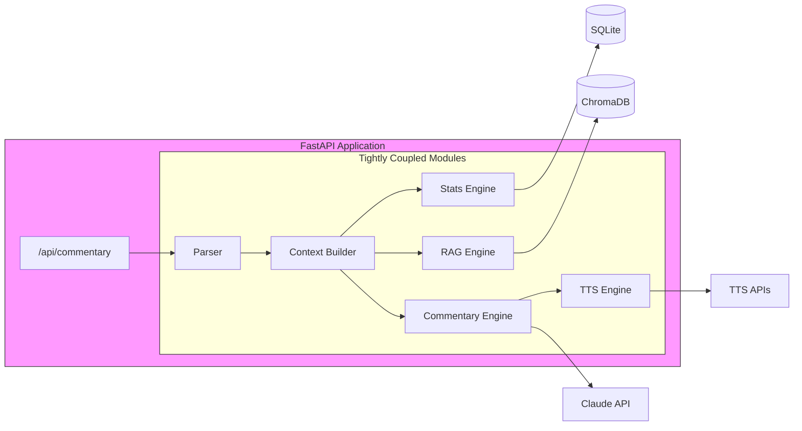
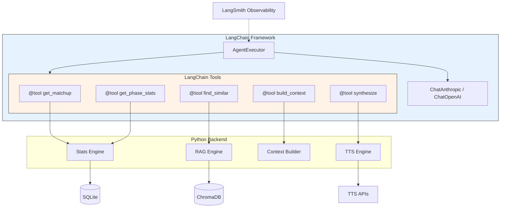
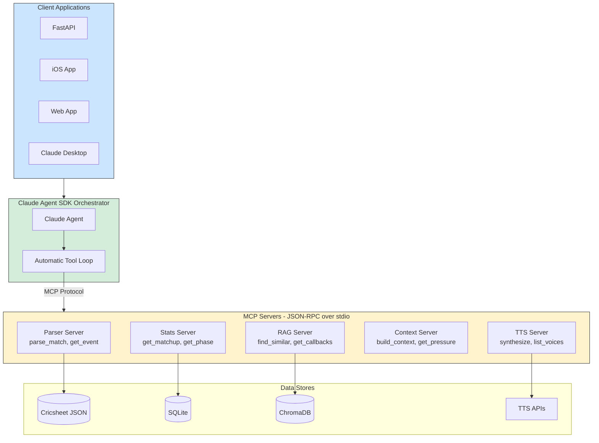
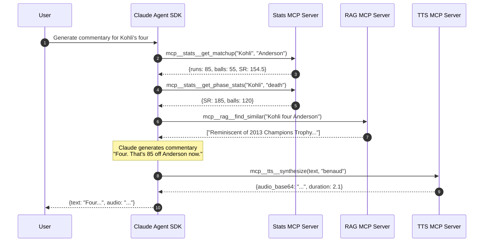

# MCP Servers + Claude Agent SDK Architecture

> **Status**: Planned
> **Created**: January 8, 2025

## Overview

Refactor Suksham Vachak to use **MCP (Model Context Protocol) servers** for domain capabilities and **Claude Agent SDK** as the orchestrator. This creates a clean separation between "what tools exist" (MCP) and "how to use them" (Claude Agent SDK).

---

## Architecture

```
┌─────────────────────────────────────────────────────────────────────────┐
│                    CLAUDE AGENT SDK (Orchestrator)                       │
│                                                                          │
│   User: "Generate commentary for Kohli's boundary off Anderson"         │
│                                                                          │
│   Claude Agent:                                                          │
│   1. Call mcp__stats__get_matchup("V Kohli", "JM Anderson")             │
│   2. Call mcp__stats__get_phase_stats("V Kohli", "death", "T20")        │
│   3. Call mcp__rag__find_similar("Kohli boundary death overs")          │
│   4. Call mcp__context__build_rich_context(event_data)                  │
│   5. Generate commentary with all context                                │
│   6. Call mcp__tts__synthesize(commentary, "benaud")                    │
│                                                                          │
└─────────────────────────┬───────────────────────────────────────────────┘
                          │ MCP Protocol (JSON-RPC over stdio)
          ┌───────────────┼───────────────┬───────────────┬───────────────┐
          ▼               ▼               ▼               ▼               ▼
   ┌─────────────┐ ┌─────────────┐ ┌─────────────┐ ┌─────────────┐ ┌─────────────┐
   │ MCP Server  │ │ MCP Server  │ │ MCP Server  │ │ MCP Server  │ │ MCP Server  │
   │   PARSER    │ │    STATS    │ │     RAG     │ │   CONTEXT   │ │     TTS     │
   │             │ │             │ │             │ │             │ │             │
   │ parse_match │ │ get_matchup │ │ find_similar│ │ build_ctx   │ │ synthesize  │
   │ get_moments │ │ get_phase   │ │ add_moment  │ │ get_pressure│ │ list_voices │
   │ get_event   │ │ get_form    │ │ query       │ │ get_narrative│ │ clone_voice│
   └──────┬──────┘ └──────┬──────┘ └──────┬──────┘ └──────┬──────┘ └──────┬──────┘
          │               │               │               │               │
          ▼               ▼               ▼               ▼               ▼
    Cricsheet JSON    SQLite DB      ChromaDB       In-Memory        TTS APIs
```

---

## Approach Comparison: Pros & Cons

### Approach 1: Current (Direct Python Calls)



```python
# Current approach - tightly coupled
stats = matchup_engine.get_head_to_head(batter, bowler)
rag_results = retriever.retrieve(event, match, pressure)
context = context_builder.build(event)
```

| Pros                         | Cons                                       |
| ---------------------------- | ------------------------------------------ |
| Simple, no protocol overhead | Tightly coupled, hard to test in isolation |
| Fast (in-process calls)      | Can't run components on separate machines  |
| No infrastructure needed     | No clear contracts between modules         |
| Easy debugging               | Can't reuse with other LLM frameworks      |
| Works today                  | Must restart entire app for any change     |

**Best for**: Prototyping, small projects, single-developer teams

---

### Approach 2: LangChain Tools



```python
# LangChain approach
@tool
def get_matchup(batter: str, bowler: str) -> str:
    """Get head-to-head statistics."""
    return json.dumps(matchup_engine.get_head_to_head(batter, bowler))

agent = create_tool_calling_agent(llm, [get_matchup, ...], prompt)
executor = AgentExecutor(agent=agent, tools=tools)
```

| Pros                                     | Cons                                           |
| ---------------------------------------- | ---------------------------------------------- |
| Large ecosystem (1000+ integrations)     | Heavy abstraction overhead                     |
| Multi-LLM support (GPT-4, Claude, Llama) | Frequent breaking changes                      |
| Community support                        | Generic abstractions don't optimize for Claude |
| LangSmith observability                  | Tools tied to LangChain framework              |
| Production deployment tools              | Steeper learning curve                         |
| Mature, battle-tested                    | Boilerplate code for tool definitions          |

**Best for**: Multi-LLM projects, teams already using LangChain

---

### Approach 3: MCP Servers + Claude Agent SDK (Recommended)





```python
# MCP Server (stats_server.py)
@server.tool("get_matchup")
async def get_matchup(batter: str, bowler: str, format: str = None) -> dict:
    """Get head-to-head statistics between batter and bowler."""
    return matchup_engine.get_head_to_head(batter, bowler, format).to_dict()

# Claude Agent SDK (orchestrator.py)
async for msg in query(
    prompt="Generate commentary for this event",
    options=ClaudeAgentOptions(
        mcp_servers={"stats": "mcp_servers/stats_server.py"},
        allowed_tools=["mcp__stats__get_matchup"]
    )
):
    print(msg)
```

| Pros                                                | Cons                              |
| --------------------------------------------------- | --------------------------------- |
| **Open standard** - MCP works with any client       | Claude-only (no GPT-4/Llama)      |
| **Clean separation** - Each server owns one domain  | Newer, less community content     |
| **Independent testing** - Test stats without LLM    | Requires MCP runtime              |
| **Reusable** - Same servers work in Claude Desktop  | More initial setup                |
| **Language agnostic** - MCP servers in any language | Protocol overhead (JSON-RPC)      |
| **Type-safe** - JSON schema enforces contracts      | Learning curve for MCP protocol   |
| **Scalable** - Run servers on different machines    | Debugging across process boundary |
| **Versioned** - Upgrade one server independently    |                                   |
| **Automatic tool loop** - No manual orchestration   |                                   |

**Best for**: Claude-focused projects, clean architecture, team development

---

## Visual Comparison: All Three Approaches

```mermaid
graph LR
    subgraph Current [Approach 1: Current]
        direction TB
        C1[FastAPI] --> C2[Coupled Modules]
        C2 --> C3[Direct Calls]
    end

    subgraph LC [Approach 2: LangChain]
        direction TB
        L1[FastAPI] --> L2[LangChain Agent]
        L2 --> L3[@tool decorators]
        L3 --> L4[Modules]
    end

    subgraph MCP [Approach 3: MCP + Claude SDK]
        direction TB
        M1[Any Client] --> M2[Claude Agent SDK]
        M2 --> M3[MCP Protocol]
        M3 --> M4[Independent Servers]
    end

    style Current fill:#ffcccc
    style LC fill:#ffffcc
    style MCP fill:#ccffcc
```

## Why MCP + Claude Agent SDK for Suksham Vachak

| Requirement             | Current    | LangChain   | MCP + Claude SDK   |
| ----------------------- | ---------- | ----------- | ------------------ |
| We're Claude-only       | ✅         | Overkill    | ✅ Perfect fit     |
| Clean separation        | ❌ Coupled | ⚠️ Partial  | ✅ Full separation |
| Independent testing     | ❌ Hard    | ⚠️ Possible | ✅ Easy            |
| Reuse in Claude Desktop | ❌ No      | ❌ No       | ✅ Yes             |
| Tool orchestration      | Manual     | Semi-auto   | ✅ Automatic       |
| Future iOS/Web clients  | Manual API | Manual API  | Same MCP servers   |
| Learning investment     | None       | High        | Medium             |

---

## MCP Servers to Build

### 1. Parser Server (`mcp_servers/parser_server.py`)

**Tools:**
| Tool | Input | Output | Purpose |
|------|-------|--------|---------|
| `parse_match` | `match_id: str` | `MatchInfo` | Load match metadata |
| `get_event` | `match_id: str, ball: str` | `CricketEvent` | Get specific delivery |
| `get_moments` | `match_id: str, types: list` | `list[CricketEvent]` | Get key moments |
| `list_matches` | - | `list[MatchInfo]` | Available matches |

**Wraps:** `CricsheetParser`

---

### 2. Stats Server (`mcp_servers/stats_server.py`)

**Tools:**
| Tool | Input | Output | Purpose |
|------|-------|--------|---------|
| `get_matchup` | `batter, bowler, format?` | `PlayerMatchupStats` | Head-to-head |
| `get_phase_stats` | `player, phase, format, role` | `PhaseStats` | Phase performance |
| `get_recent_form` | `player, role, format?` | `RecentForm` | Form + trend |
| `get_batter_nemesis` | `batter, min_dismissals` | `list[PlayerMatchupStats]` | Danger bowlers |
| `get_bowler_bunnies` | `bowler, min_dismissals` | `list[PlayerMatchupStats]` | Favorite victims |

**Wraps:** `MatchupEngine`, `PhaseEngine`, `FormEngine`

---

### 3. RAG Server (`mcp_servers/rag_server.py`)

**Tools:**
| Tool | Input | Output | Purpose |
|------|-------|--------|---------|
| `find_similar` | `query, format?, phase?, pressure?` | `list[RetrievedMoment]` | Similarity search |
| `find_by_player` | `player_name, n_results` | `list[RetrievedMoment]` | Player moments |
| `find_by_situation` | `phase, pressure, format` | `list[RetrievedMoment]` | Situational |
| `add_moment` | `CricketMoment` | `success: bool` | Ingest moment |
| `get_callbacks` | `event, match, pressure` | `list[str]` | Commentary callbacks |

**Wraps:** `DejaVuRetriever`, `MomentVectorStore`

---

### 4. Context Server (`mcp_servers/context_server.py`)

**Tools:**
| Tool | Input | Output | Purpose |
|------|-------|--------|---------|
| `build_rich_context` | `event: CricketEvent` | `RichContext` | Full context |
| `calculate_pressure` | `match, wickets, is_new, balls_since_boundary` | `{level, score, description}` | Pressure calc |
| `get_narrative` | `event, batter_runs, bowler_wickets, ...` | `NarrativeState` | Storyline |
| `detect_phase` | `overs, format` | `MatchPhase` | Match phase |

**Wraps:** `ContextBuilder`, `PressureCalculator`, `NarrativeTracker`

---

### 5. TTS Server (`mcp_servers/tts_server.py`)

**Tools:**
| Tool | Input | Output | Purpose |
|------|-------|--------|---------|
| `synthesize` | `text, persona, language, use_ssml` | `{audio_base64, duration}` | Generate audio |
| `list_voices` | `provider?` | `list[VoiceInfo]` | Available voices |
| `list_providers` | - | `list[str]` | Available providers |
| `get_cache_stats` | - | `{files, size_mb}` | Cache info |
| `clear_cache` | - | `{deleted: int}` | Clear cache |

**Wraps:** `TTSEngine`, `ProsodyController`

---

## Project Structure

```
suksham_vachak/
├── mcp_servers/                    # NEW: MCP Server implementations
│   ├── __init__.py
│   ├── base.py                     # Shared utilities, error handling
│   ├── parser_server.py            # Parser MCP server
│   ├── stats_server.py             # Stats MCP server
│   ├── rag_server.py               # RAG MCP server
│   ├── context_server.py           # Context MCP server
│   └── tts_server.py               # TTS MCP server
│
├── orchestrator/                   # NEW: Claude Agent SDK orchestrator
│   ├── __init__.py
│   ├── agent.py                    # Main orchestrator
│   ├── prompts.py                  # System prompts for agent
│   └── config.py                   # MCP server configuration
│
├── parser/                         # EXISTING (unchanged)
├── stats/                          # EXISTING (unchanged)
├── rag/                            # EXISTING (unchanged)
├── context/                        # EXISTING (unchanged)
├── tts/                            # EXISTING (unchanged)
├── personas/                       # EXISTING (unchanged)
├── commentary/                     # EXISTING (may be simplified)
└── api/                            # EXISTING (updated to use orchestrator)
```

---

## Implementation Phases

### Phase 1: MCP Infrastructure

- [ ] Install MCP Python SDK (`pip install mcp`)
- [ ] Create `mcp_servers/base.py` with shared utilities
- [ ] Create simple test server to validate setup
- [ ] Test with Claude Desktop or MCP Inspector

### Phase 2: Stats MCP Server

- [ ] Implement `stats_server.py`
- [ ] Expose: `get_matchup`, `get_phase_stats`, `get_recent_form`
- [ ] Add JSON schema for all tools
- [ ] Write tests for server

### Phase 3: RAG MCP Server

- [ ] Implement `rag_server.py`
- [ ] Expose: `find_similar`, `find_by_player`, `get_callbacks`
- [ ] Handle ChromaDB connection
- [ ] Write tests

### Phase 4: Context MCP Server

- [ ] Implement `context_server.py`
- [ ] Expose: `build_rich_context`, `calculate_pressure`, `get_narrative`
- [ ] Wire up stats + RAG integration
- [ ] Write tests

### Phase 5: Parser & TTS MCP Servers

- [ ] Implement `parser_server.py`
- [ ] Implement `tts_server.py`
- [ ] Write tests

### Phase 6: Claude Agent SDK Orchestrator

- [ ] Install Claude Agent SDK
- [ ] Create `orchestrator/agent.py`
- [ ] Configure MCP server connections
- [ ] Implement commentary generation flow
- [ ] Test end-to-end

### Phase 7: API Integration

- [ ] Update FastAPI routes to use orchestrator
- [ ] Maintain backward compatibility
- [ ] Performance testing

---

## Example MCP Server Implementation

```python
# mcp_servers/stats_server.py
from mcp.server import Server
from mcp.types import Tool, TextContent
from suksham_vachak.stats import create_engines

server = Server("suksham-stats")
matchup_engine, phase_engine, form_engine = create_engines()

@server.tool()
async def get_matchup(
    batter: str,
    bowler: str,
    format: str | None = None
) -> list[TextContent]:
    """Get head-to-head statistics between a batter and bowler.

    Args:
        batter: Batter name (e.g., "V Kohli")
        bowler: Bowler name (e.g., "JM Anderson")
        format: Optional match format filter (T20, ODI, Test)

    Returns:
        Head-to-head statistics including runs, balls, dismissals, strike rate
    """
    stats = matchup_engine.get_head_to_head(batter, bowler, format)
    if stats is None:
        return [TextContent(type="text", text=f"No matchup data for {batter} vs {bowler}")]

    return [TextContent(type="text", text=json.dumps({
        "batter": stats.batter_name,
        "bowler": stats.bowler_name,
        "balls": stats.balls_faced,
        "runs": stats.runs_scored,
        "dismissals": stats.dismissals,
        "strike_rate": stats.strike_rate,
        "average": stats.average,
        "context": f"{stats.batter_name} has scored {stats.runs_scored} runs off {stats.balls_faced} balls against {stats.bowler_name} (SR: {stats.strike_rate:.1f})"
    }))]

@server.tool()
async def get_phase_stats(
    player: str,
    phase: str,
    format: str,
    role: str = "batter"
) -> list[TextContent]:
    """Get player performance in a specific match phase.

    Args:
        player: Player name
        phase: Match phase (powerplay, middle, death)
        format: Match format (T20, ODI, Test)
        role: Player role (batter or bowler)
    """
    stats = phase_engine.get_phase_performance(player, phase, format, role)
    if stats is None:
        return [TextContent(type="text", text=f"No phase data for {player} in {phase}")]

    return [TextContent(type="text", text=json.dumps({
        "player": stats.player_name,
        "phase": stats.phase,
        "format": stats.match_format,
        "balls": stats.balls,
        "runs": stats.runs,
        "strike_rate": stats.strike_rate,
        "context": f"{stats.player_name} in {phase}: SR {stats.strike_rate:.1f} ({stats.balls} balls)"
    }))]

if __name__ == "__main__":
    import asyncio
    from mcp.server.stdio import stdio_server

    asyncio.run(stdio_server(server))
```

---

## Example Orchestrator Implementation

```python
# orchestrator/agent.py
from claude_agent_sdk import query, ClaudeAgentOptions

MCP_SERVERS = {
    "stats": "python mcp_servers/stats_server.py",
    "rag": "python mcp_servers/rag_server.py",
    "context": "python mcp_servers/context_server.py",
    "tts": "python mcp_servers/tts_server.py",
    "parser": "python mcp_servers/parser_server.py",
}

COMMENTARY_PROMPT = """
You are a cricket commentary generator. Generate {persona}-style commentary for the given event.

Steps:
1. Use get_matchup to understand batter vs bowler history
2. Use get_phase_stats to understand phase context
3. Use get_recent_form to understand current form
4. Use find_similar to find historical parallels
5. Generate commentary that incorporates all context
6. Keep it {length} and {tone}

Event: {event}
"""

async def generate_commentary(
    event_data: dict,
    persona: str,
    use_tts: bool = True
):
    async for message in query(
        prompt=COMMENTARY_PROMPT.format(
            persona=persona,
            event=json.dumps(event_data),
            length="brief" if persona == "benaud" else "moderate",
            tone="understated" if persona == "benaud" else "dramatic"
        ),
        options=ClaudeAgentOptions(
            mcp_servers=MCP_SERVERS,
            allowed_tools=[
                "mcp__stats__get_matchup",
                "mcp__stats__get_phase_stats",
                "mcp__stats__get_recent_form",
                "mcp__rag__find_similar",
                "mcp__context__build_rich_context",
            ]
        )
    ):
        if hasattr(message, "text"):
            commentary_text = message.text

    if use_tts:
        async for msg in query(
            prompt=f"Synthesize this commentary: {commentary_text}",
            options=ClaudeAgentOptions(
                mcp_servers={"tts": MCP_SERVERS["tts"]},
                allowed_tools=["mcp__tts__synthesize"]
            )
        ):
            if hasattr(msg, "audio_base64"):
                return {"text": commentary_text, "audio": msg.audio_base64}

    return {"text": commentary_text}
```

---

## Files to Create

| File                            | Purpose           | Lines (est)    |
| ------------------------------- | ----------------- | -------------- |
| `mcp_servers/__init__.py`       | Package init      | 10             |
| `mcp_servers/base.py`           | Shared utilities  | 50             |
| `mcp_servers/parser_server.py`  | Parser tools      | 100            |
| `mcp_servers/stats_server.py`   | Stats tools       | 150            |
| `mcp_servers/rag_server.py`     | RAG tools         | 120            |
| `mcp_servers/context_server.py` | Context tools     | 130            |
| `mcp_servers/tts_server.py`     | TTS tools         | 100            |
| `orchestrator/__init__.py`      | Package init      | 10             |
| `orchestrator/agent.py`         | Main orchestrator | 150            |
| `orchestrator/prompts.py`       | System prompts    | 80             |
| `orchestrator/config.py`        | Configuration     | 40             |
| **Total**                       |                   | **~940 lines** |

---

## Dependencies to Add

```toml
# pyproject.toml additions
[tool.poetry.dependencies]
mcp = "^1.0.0"                    # MCP Python SDK
claude-agent-sdk = "^1.0.0"       # Claude Agent SDK
```

---

## Migration Path

```
Current Architecture:
┌─────────────┐
│  FastAPI    │──▶ Direct Python calls to Stats/RAG/Context/TTS
└─────────────┘

Phase 1 (Parallel):
┌─────────────┐     ┌─────────────┐
│  FastAPI    │──▶ │  Direct     │  (existing, unchanged)
└─────────────┘     └─────────────┘
                    ┌─────────────┐
                    │ MCP Servers │  (new, running in parallel)
                    └─────────────┘

Phase 2 (Orchestrator):
┌─────────────┐     ┌─────────────┐     ┌─────────────┐
│  FastAPI    │──▶ │ Orchestrator│──▶ │ MCP Servers │
└─────────────┘     └─────────────┘     └─────────────┘

Phase 3 (Complete):
┌─────────────┐     ┌─────────────┐     ┌─────────────┐
│  FastAPI    │──▶ │ Claude Agent│──▶ │ MCP Servers │
│  iOS App    │     │    SDK      │     │             │
│  Web App    │     │ Orchestrator│     │ Stats/RAG/  │
└─────────────┘     └─────────────┘     │ Context/TTS │
                                        └─────────────┘
```

---

## Summary

| Aspect            | Decision                                     |
| ----------------- | -------------------------------------------- |
| Orchestrator      | Claude Agent SDK                             |
| Domain Tools      | MCP Servers                                  |
| Protocol          | MCP (JSON-RPC over stdio)                    |
| Why not LangChain | Overkill for Claude-only, heavy abstractions |
| Key Benefit       | Clean separation, reusable, testable         |
| Migration         | Incremental, backward compatible             |
| New Files         | ~11 files, ~940 lines                        |
